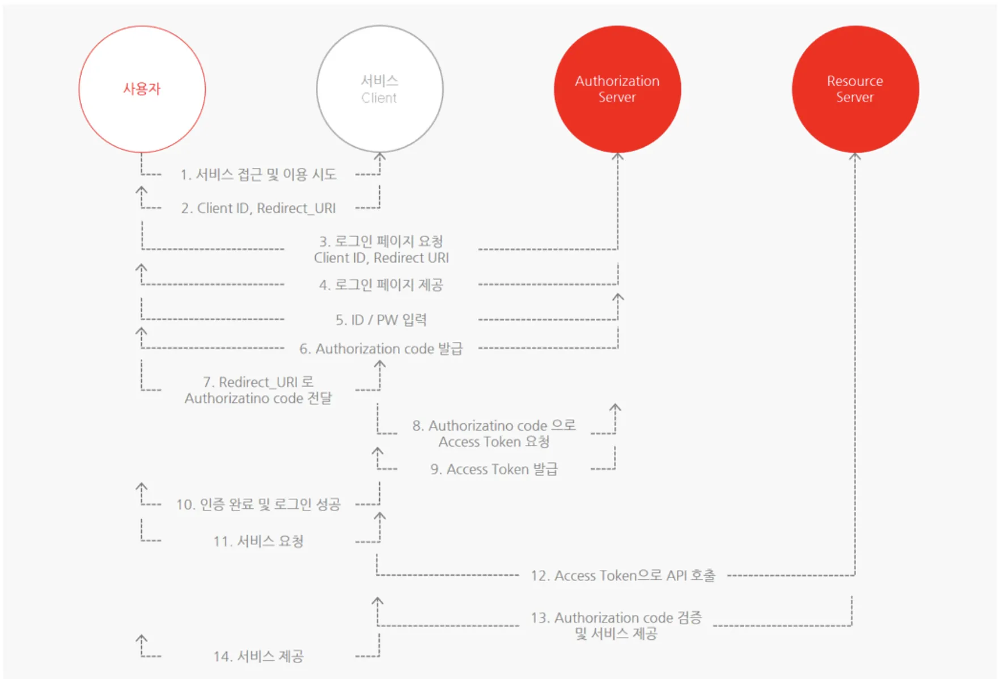
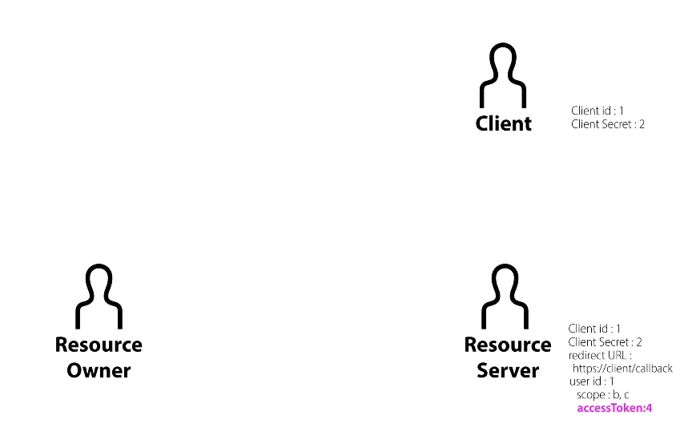

## OAuth란

> 인터넷 사용자들이 비밀번호를 제공하지 않고 다른 웹사이트 상의 자신들의 정보에 대해 웹사이트나 애플리케이션의 접근 권한을 부여할 수 있는 공통적인 수단으로서 사용되는 접근 위임을 위한 개방형 표준이다.

### 전체

### 구성 요소

**`Resource Owner`**

- 웹 서비스를 이용하려는 사용자
- 계정을 가진 사용자

**`Client`**

- Resource Owner를 대신해 자원에 접근하려는 애플리케이션
- 예를 들면 카카오 계정으로 로그인 기능을 제공하려는 애플리케이션

**`Resource Server`**

- 사용자의 정보(자원)를 가지고 있는 서버
- 카카오, 구글 등
- 데이터를 가지고 있는 서버

**`Authorization Server`**

- 인증 관련 처리 전담
- resource server랑 합쳐서 resource server라고도 함

 

### 등록

client 가 자원에 접근하려면 사전에 resource server 승인을 받아야 함. 이 과정이 등록(register)

- Client ID : 애플리케이션 식별자, 노출돼도 됨
- Client Secret : 비밀번호, 노출 X
- Authorized redirect URIs
  - resource server가 권한을 부여하는 과정에서 authorized code를 전달해줄 때 전달해줄 주소
  - 이 주소 말고 다른 데서 요청이 들어오면 거부함
  - 인증이 완료된 후에 어디로 사용자 브라우저를 리다이렉션할 지 지정
  - 클라이언트가 지정

 

### Resource Owner의 승인

등록을 하면 Resource Server는 id, secret, redirect url을 알게 됨

client는 client id, client secret 정보를 가지고 있음

client id, client secret은 resource server에서 애플리케이션을 식별하는 용도

사전에 등록한, 약속한 그 애플리케이션에서 보내는 요청인지 확인

내(개발자)가 id, secret을 백엔드에 보관해놓음

resource owner가 resource server로 ‘구글로 로그인하기’버튼을 누르면

[`https://authorization.server/?client_id=1&scope=B,C&redirect_uri=https://client/callback`](https://resource.server/?client_id=1&scope=B,C&redirect_uri=https://client/callback) 이런 주소로 이동함

resource owner의 로그인 여부를 판단하고 로그인이 안되어있으면 로그인 화면을 보내줌

로그인을 성공하면 resource server 자신이 가지고 있는 client id의 redierct URL과 요청이 들어온 redirect URL을 확인

일치하면 scope에 해당하는 권한을 client에 부여할 것인지 resource owner에게 전송

resource owner의 user id, scope 권한 정보 저장함

여기서 client는 redirect할 페이지를 미리 만들어둬야함

 

### Resource Server의 승인

위에서 resource owner의 승인을 받음

이제는 resource server의 승인 必

authorization code라는 임시 비밀번호를 resource server는 resource owner에게 전송

HTTP 응답의 Location 헤더에 담아서 전송 https://client/callback?code=3 (이런형태로)

그러면 resource owner는 저 주소로 이동하게 됨(리다이렉트)

client는 authorization code 값을 알게됨

이제 client는 resource owner를 거치지 않고 resource server로 직접 접속

`https://resource.server/token?`

`grant_type-authorization_code&`

`code=3&`

`redirect_uri=https://client/callback&`

`client_id=1&`

`client_secret=2`

이런 주소로 접속함

authorization_code, client_id, client_secret, redirect \_uri이 모두 일치하는 지 확인

모두 일치하면 토큰 발급

 

### 액세스 토큰 발급

인증이 됐으니 재사용을 막기 위해 authorization_code를 지움(일회용)

resource server는 accessToken을 발급함

client에 accessToken을 응답함

client는 accessToken을 내부적으로 저장

if ) accessToken : 4 / user_id : 1 / scope : b,c

client가 4라는 accessToken으로 resource server에 접근을 하면

4라는 토큰에 대해서

user id가 1인 사용자의 b,c 기능을 accessToken 4를 가진 사람에게 권한 허용

 

### API 호출

resource server가 client들에게 우리(resource server) 쓰려면 이렇게 하삼ㅇㅇ

### refreshToken

accessToken은 수명 있음

accessToken을 다시 발급받아야함. 그때마다 위 과정을 거치면 힘들다

새로 accessToken을 발급받을 수 있는 방법이 refreshToken

🔵 **OAuth의 핵심**

⇒ client 입장에서 제3자인 resource server를 통해서 resource owner의 신원을 인증할 수 있다는 것

 

### 추가 학습

[RFC 6749](https://datatracker.ietf.org/doc/html/rfc6749#section-1.5)

federated identity

restful, json, xml

 

### 참고한 글

[WEB2-OAuth](https://www.youtube.com/playlist?list=PLuHgQVnccGMA4guyznDlykFJh28_R08Q-)

[🌐 OAuth 2.0 개념 - 그림으로 이해하기 쉽게 설명](https://inpa.tistory.com/entry/WEB-%F0%9F%93%9A-OAuth-20-%EA%B0%9C%EB%85%90-%F0%9F%92%AF-%EC%A0%95%EB%A6%AC?restoreScroll=1069.3333740234375)
