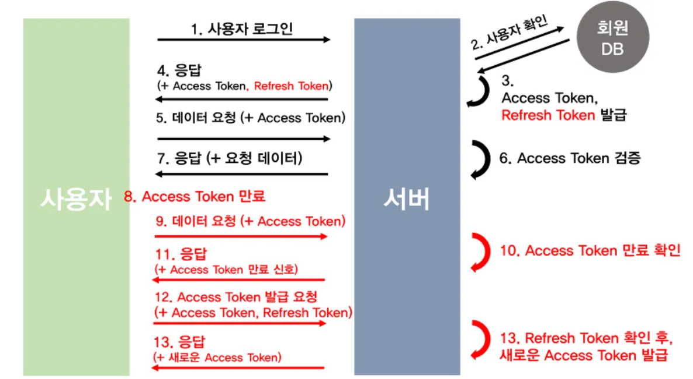

### **JWT(JSON Web Token)란?**

> 인증에 필요한 정보들을 암호화시킨 JSON 토큰<br/>
> 사용자 인증 정보를 담고 있는 토큰(사용자의 신원정보 + 권한)

### JWT 기반 인증

⇒ 토큰을 헤더에 담아서 서버에 전달. 서버는 클라이언트를 식별하는 방식

- 다시 로그인 할 필요x
- 토큰을 보내면 서버가 인증해줌
- 토큰을 localStorage에 저장함
- 서버에 저장하지 않음

### 구조

- 헤더(header)
  - 타입
  - 해시 알고리즘 종류
- 내용(payload)
  - 사용자 정보
- 서명(signature)
  - (헤더+페이로드+key값) → 암호화하여 저장

### 인증 과정

1. 사용자 로그인
2. jwt access token 발급
   1. localStorage에 저장
3. 클라이언트가 서버에 요청을 보낼 때 토큰을 헤더에 담아서 보냄
4. 서버는 그 토큰이 유효한지 검증하고 응답 보내줌

### 웹 스토리지

브라우저가 제공하는 데이터 저장소

개발자 도구 → Application 탭에서 확인 가능

1. localStorage
   - 탭을 닫아도 유지됨
2. sessionStorage
   - 브라우저 탭을 닫으면 사라짐

### 토큰 사용하기

토큰 저장 : `localStorage.setItem('accessToken', token)`

토큰 꺼내쓰기 : `const token = localStorage.getItem('accessToken')`

### 요청 보낼 때

```jsx
axios.get("api주소", {
  headers: {
    Authorization: `Bearer ${token}`,
  },
});
```

### 토큰은 유효 시간이 있음

만료되면 다시 로그인하거나 `refreshToken`으로 재발급 받아야됨

만료되면 `401` 응답이 옴 → _다시 로그인 하세유_

## refreshToken

accessToken의 보안 취약점 보완

- accessToken은 서버에 저장되지 않고 토큰 자체로 검증(사용자 권한 인증)
- accessToken이 탈취되면 토큰이 만료되기 전까지는 누구나 접근 가능
- jwt는 삭제가 불가능 → 유효시간 부여하는 식으로 문제 해결
  <br/>

→ **refreshToken** 등장

refreshToken은 accessToken보다 긴 유효시간을 가짐

accessToken이 만료됐을때 새로 재발급해줌

만료된 accessToken을 보내면 서버가 refreshToken을 확인하고 accessToken을 재발급해줌

refreshToken은 accessToken 재발급에만 관여함

보통 2주로 설정

refreshToken은 DB에 저장된다

### 재발급 여부

| accessToken | refreshToken |                                            |
| ----------- | ------------ | ------------------------------------------ |
| 만료        | 만료         | 재로그인으로 둘 다 새로 발급               |
| 만료        | 유효         | refreshToken을 검증하여 accessToken 재발급 |
| 유효        | 만료         | accessToken을 검증하여 refreshToken 재발급 |
| 유효        | 유효         | 정상 처리                                  |

### 인증 과정



- 9~11 과정
  - 클라이언트 측에서 accessToken의 payload를 통해 유효 기간 알 수 있음
  - 위 과정을 거치지 않고 바로 재발급 요청 가능

### 참고한 글

[JWT 대충 쓰면 님들 코딩인생 끝남](https://youtu.be/XXseiON9CV0?si=UFt1tv7vPCIHUN6J)

[세션 vs 토큰 vs 쿠키? 기초개념 잡아드림. 10분 순삭!](https://youtu.be/tosLBcAX1vk?si=Pdt7xRoKeqf2QeyJ)

[🌐 JWT 토큰 인증 이란? (쿠키 vs 세션 vs 토큰)](https://inpa.tistory.com/559)

[🌐 Access Token & Refresh Token 원리](https://inpa.tistory.com/entry/WEB-%F0%9F%93%9A-Access-Token-Refresh-Token-%EC%9B%90%EB%A6%AC-feat-JWT)

[[인증인가] Access Token, Refresh Token의 저장 위치에 대한 고찰](https://olrlobt.tistory.com/98#refresh-token)
