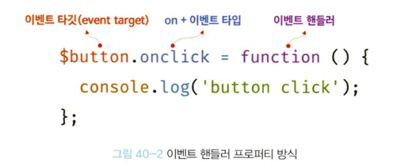
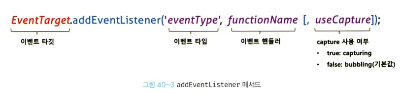

## 1. 이벤트 드리븐 프로그래밍

**이벤트 발생**

- 클릭, 키보드 입력, 마우스 이동 …
- → 특정 타입의 벤트 발생시킴

**이벤트 핸들러(event handler)**

: 이벤트가 발생했을 때 호출될 함수

**이벤트 핸들러 등록**

: 이벤트가 발생했을 때 브라우저에게 이벤트 핸들러의 호출을 위임하는 것

```html
<script>
  const $button = document.querySelector('button')
  $button.onClick = () => {
    alert('button clicked')
  }
</script>
```

- Window, Document, HTMLElement 타입 객체 → onclick과 같이 특정 이벤ㅌ에 대응하는 다양한 이벤트 핸들러를 가지고 있음
- 이벤트 핸들러에 함수를 할당하면
  - 해당 이벤트가 발생했을때
  - 할당한 함수가 브라우저에 의해 호출됨

**`사용자와 애플리케이션은 상호작용 => 이벤트와 그에 대응하는 함수(이벤트 핸들러)`**

## 2. 이벤트 타입

=== 이벤트 종류를 나타내는 문자열 <br/>
[MDN Event reference 문서](https://developer.mozilla.org/en-US/docs/Web/Events)

### 2.1 마우스 이벤트

| 이벤트 타입 | 이벤트 발생시점                                              |
| ----------- | ------------------------------------------------------------ |
| click       | 마우스 버튼 클릭 시                                          |
| dblclick    | 마우스 버튼을 더블 클릭 했을 시                              |
| mousedown   | 마우스 버튼을 눌렀을 때                                      |
| mouseup     | s누르고 있던 마우스 버튼을 놓았을 때                         |
| mousemove   | 마우스 커서를 움직였을 때                                    |
| mouseenter  | 마우스 커서를 html 요소 안으로 이동했을 때(버블링 되지 않음) |
| mouseover   | 마우스 커서를 html 요소 안으로 이동했을 때(버블링 됨)        |
| mouseleave  | 마우스 커서를 html 요소 밖으로 이동했을 때(버블링 되지 않음) |
| mouseout    | 마우스 커서를 html 요소 밖으로 이동했을 때(버블링 됨)        |

### 2.2 키보드 이벤트

| 이벤트 타입 | 이벤트 발생 시점                       |
| ----------- | -------------------------------------- |
| keydown     | 모든 키를 눌렀을 때 발생               |
| keypress    | 문자 키를 눌렀을 때 연속으로 발생      |
| keyup       | 누르고 있던 키를 놓았을 때 한번만 발생 |

### 2.3 포커스 이벤트

| 이벤트 타입 | 이벤트 발생 시점               |
| ----------- | ------------------------------ |
| focus       | html 요소가 포커스를 받았을때  |
| blur        | html 요소가 포커스를 잃었을때  |
| focusin     | html 요소가 포커스를 받았을 때 |
| focusout    | html 요소가 포커스를 잃었을 때 |

### 2.4 폼 이벤트

| 이벤트 타입 | 이벤트 발생 시점                                         |
| ----------- | -------------------------------------------------------- |
| submit      | form 요소 내의 submit 버튼을 클릭했을 때                 |
| reset       | form 요소 내의 reset 버튼을 클릭했을 때(최근에는 사용 X) |

### 2.5 값 변경 이벤트

| 이벤트 타입      | 이벤트 발생 시점                                                                                                 |
| ---------------- | ---------------------------------------------------------------------------------------------------------------- |
| input            | input, select, textarea 요소의 값이 입력 됐을 때                                                                 |
| change           | input, select, textarea 요소의 값이 변경 됐을 때                                                                 |
| readystatechange | html 문서의 로드와 파싱 상태를 나타내는 readyState(loading, interactive, complate) 프로퍼티 값 이 변경 되었을 때 |

### 2.6 DOM 뮤테이션 이벤트

| 이벤트 타입      | 이벤트 발생 시점                                             |
| ---------------- | ------------------------------------------------------------ |
| DOMContentLoaded | html 문서의 로드와 파싱이 완료되어 DOM 생성이 완료 되었을 때 |

### 2.7 뷰 이벤트

| 이벤트 타입 | 이벤트 발생 시점                                         |
| ----------- | -------------------------------------------------------- |
| resize      | 브라우저 윈도우의 크기를 리사이즈할 때 연속적으로 발생함 |
| scroll      | 웹페이지 또는 html 요소를 스크롤 할때 발생 함            |

### 2.8 리소스 이벤트

| 이벤트 타입 | 이벤트 발생 시점                                                           |
| ----------- | -------------------------------------------------------------------------- |
| load        | DOMContentLoaded 이벤트가 발생한 이후, 모든 리소스의 로딩이 완료 되었을 때 |
| unload      | 리소스가 언로드 될 때                                                      |
| abort       | 리소스 로딩이 중단되었을 때                                                |
| error       | 리소스 로딩이 실패했을 때                                                  |

## 3. 이벤트 핸들러 등록

**이벤트 핸들러** : 이벤트가 발생하면 브라우저에 의해 호출될 함수(브라우저에 호출을 위임한 함수)

### 3.1 이벤트 핸들러 어트리뷰트 방식

- `on` + 이벤트 타입 : 이벤트 핸들러 어트리뷰트
- 이벤트 핸들러 어트리뷰트 값으로 함수 호출문 등의 문(statement)을 할당하면 이벤트 핸들러가 등록됨

```html
<body>
  <button onclick='sayHi("Lee")'>Click me!</button>
  <script>
    function sayHi(name) {
      console.log(`Hi ${name}`)
    }
  </script>
</body>
```

- 함수 참조가 아닌 **함수 호출문을 할당함**!<br/><br/>
- 이벤트 핸들러 등록 === 함수 호출을 브라우저에게 위임하는 것 - 이벤트 핸들러를 등록할 때 함수 참조를 등록해야 브라우저가 이벤트 핸들러 호출 가능 - 함수 호출문을 할당하면 함수 호출문 평가 결과가 이벤트 핸들러로 등록됨 - 함수가 아닌 값을 반환하는 함수 호출문을 등록하면 브라우저가 호출 불가
  <br/><br/>

but, 위 코드에서는 함수 호출문을 할당함!

**이벤트 핸들러 어트리뷰트 값은 사실 암묵적으로 생성될 이벤트 핸들러의 함수 몸체를 의미함**

- `sayHi('Lee')`라고 할당하면 다음과 같이 함수를 암묵적으로 생성하고 할당함

```script
function onclick(event) {
	sayHi('Lee')
}
```

-> 왜 이렇게 동작?<br/>

인수를 전달하기 위해서!!!<br/>

`<button onclick='sayHi'>Click me!</button>`<br/>

함수 참조로 할당하려면 이렇게 적어야 되니까…<br/>

프레임워크/라이브러리에서는 이렇게 작성하긴 함…<br/>

### 3.2 이벤트 핸들러 프로퍼티 방식

window 객체, Document, HTMLElement 타입의 DOM 노드 객체 → 이벤트에 대응하는 이벤트 핸들러 프로퍼티를 가짐<br/>

`on` 접두사 + 이벤트 타입<br/>

이벤트 핸들러 프로퍼티에 함수를 바인딩하면 이벤트 핸들러가 등록됨<br/>

```html
<body>
  <button>Click me!</button>
  <script>
    const $button = document.querySelector('button')

    button.onclick = function () {
      console.log('clicked')
    }
  </script>
</body>
```

<br/>



- **이벤트 타깃 :** 이벤트를 발생시킬 객체
- **이벤트 타입** : 이벤트 종류를 나타내는 문자열
- **이벤트 핸들러** : 호출될 함수
  <br/>
  이벤트 핸들러 프로퍼티에 하나의 이벤트 핸들러만 바인딩 가능<br/>

같은 이벤트 타겟에 두번 바인딩할 경우 첫번째 이벤트 핸들러는 두번째에 의해 재할당되어 실행되지 않음<br/>

### 3.3 addEventListener 방식



```html
<button>Click me!</button>
<script>
  const button = document.querySelector('button')

  button.addEventListener('click', function() {
  	console.log('clicked')
  }
</script>
```

- 이벤트 핸들러를 인수로 전달함
  <br/>
  동일한 요소에서 발생한 동일한 이벤트에 대해 프로퍼티, addEventListener 방식을 모두 사용하면?

```html
<button>Click me!</button>
<script>
  const $button = document.querySelector('button')

  // 이벤트 핸들러 프로퍼티 방식
  $button.onclick = function () {
    console.log('[이벤트 핸들러 프로퍼티 방식]button click')
  }

  // addEventListener 메서드 방식
  $button.addEventListener('click', function () {
    console.log('[addEventListener 메서드 방식]button click')
  })
</script>
```

→ 2개 다 호출됨!<br/>

addEventListener 메서드 방식은 이벤트 핸들러 프로퍼티에 바인딩된 이벤트 핸들러에 아무런 영향 주지 않음<br/>

addEventListener 메서드는 하나 이상의 이벤트 핸들러 등록 가능<br/>

등록 순서대로 호출됨<br/><br/>

대신 참조가 동일한 이벤트 핸들러를 중복 등록하면??<br/>

```html
<button>Click me!</button>
<script>
  const $button = document.querySelector('button')

  // addEventListener 메서드는 동일한 요소에서 발생한 동일한 이벤트에 대해
  // 하나 이상의 이벤트 핸들러를 등록할 수 있다.
  $button.addEventListener('click', function () {
    console.log('[1]button click')
  })

  $button.addEventListener('click', function () {
    console.log('[2]button click')
  })
</script>
```

→ 하나만 등록됨
