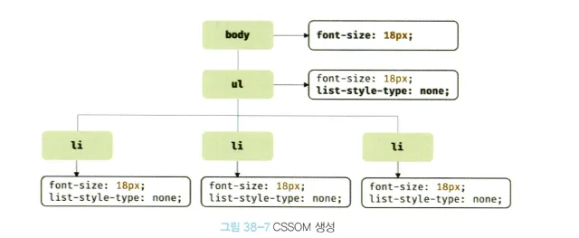

모던 자바스크립트 Deep Dive p. 660 - 676

# 브라우저 렌더링 과정

**목차**

- [개요](#개요)
- [1. 요청과 응답](#1-요청과-응답)
- [2. HTTP 1.1과 HTTP 2.0](#2-http-11과-http-20)
- [3. HTML 파싱과 DOM 생성](#3-html-파싱과-dom-생성)
- [4. CSS 파싱과 CSSOM 생성](#4-css-파싱과-cssom-생성)
- [5. 렌더 트리 생성](#5-렌더-트리-생성)
- [6. 자바스크립트 파싱과 실행](#6-자바스크립트-파싱과-실행)
- [7. 리플로우와 리페인드](#7-리플로우와-리페인트)
- [8. 자바스크립트 파싱에 의한 HTML 파싱 중단](#8-자바스크립트-파싱에-의한-html-파싱-중단)
- [9. script 태그 async/defer 어트리뷰트](#9-script-태그-asyncdefer-어트리뷰트)

---

## 개요

- 자바스크립트의 런타임 환경 Node.js 등장
- 웹 브라우저 환경 외에서도 동작

- 자바스크립트는 브라우저에서 HTML, CSS와 함께 실행됨
- HTML, CSS, JS로 작성된 텍스트 문서를 어떻게 **파싱(해석)** 하여 브라우저에 **렌더링**?
  - 파싱(parshing)
    - 텍스트 문서의 문자열을 토큰으로 분해
    - 토큰에 문법적 의미와 구조를 반영하여
    - 파스 트리 생성하는 과정
    - 파스트리를 기반으로 중간 언어인 바이트 코드를 생성하고 실행함
  - 렌더링(rendering)
    - 문서를 파싱하여 브라우저에 시각적으로 출력하는 것

<critical rendering path>


## 1. 요청과 응답

**브라우저의 핵심 기능**

리소스를 서버에 요청하고 서버로부터 응답 받아서 브라우저에 시각적으로 렌더링하는 것

**서버에 요청 전송하기**

브라우저의 주소창을 통해 요청을 전송함

- 주소창에 URL을 입력하고 엔터키를 누르면
- URL의 호스트 이름이 DNS를 통해 IP주소로 변환되고
- 이 IP 주소를 갖는 서버에게 요청을 전송함

<details>
<summary>DNS</summary>
<div markdown="1">

Domain Name System
사람이 읽을 수 있는 도메인 이름을 컴퓨터가 이해할 수 있는 IP 주소로 변환해 주는 시스템
ex. [`naver.com`](http://naver.com) 의 IP 주소는 `223.130.200.104`


</div>
</details>
<br/>


1. 브라우저의 주소창에 `https://poiemaweb.com` 입력
2. scheme, host로 이루어진 요청이 `poiemaweb.com` 서버로 전송됨
3. 루트 요청에 대해 서버는 암묵적으로 `index.html` 응답


서버에 요청한 내용과 서버가 응답한 내용을 Network 패널에서 확인 가능

index.html 외에도 css, 자바스크립트, 이미지, 폰트 파일들도 함께 응답됨

- index.html 문서를 파싱하는 도중에 외부 리소스를 로드하는 태그를 만나면 해당 리소스 파일을 서버로 요청함

## 2. HTTP 1.1과 HTTP 2.0

**HTTP** (HyperText Transfer Protocol) : 웹에서 브라우저와 서버가 통신하기 위한 프로토콜(규약)

**HTTP 1.1**

- 커넥션당 하나의 요청과 응답만 처리
- 여러개 요청 처리 불가
- 리소스의 동시 전송이 불가능하므로 요청할 리소스 개수에 비례하여 응답 시간 증가

**HTTP 2.0**

- 커넥션당 여러 개의 요청과 응답 가능 (다중 요청/응답 가능) ⇒ 여러 파일을 한번에 병렬로 전송
- http 1.1에 비해 속도가 50% 정도 빠름


더 자세한 내용이 궁금하다면… [🌐 HTTP 2.0 소개 & 통신 기술 알아보기](https://inpa.tistory.com/entry/WEB-%F0%9F%8C%90-HTTP-20-%ED%86%B5%EC%8B%A0-%EA%B8%B0%EC%88%A0-%EC%9D%B4%EC%A0%9C%EB%8A%94-%ED%99%95%EC%8B%A4%ED%9E%88-%EC%9D%B4%ED%95%B4%ED%95%98%EC%9E%90?restoreScroll=19300)

## 3. HTML 파싱과 DOM 생성

브라우저의 요청으로 서버가 응답한 HTML 문서는 문자열로 이루어진 순수 텍스트

이 문서를 브라우저에 시각적인 픽셀로 렌더링 하려면

→ HTML 문서를 브라우저가 이해할 수 있는 자료구조(객체)로 변환하여 메모리에 저장해야함

```html
<!DOCTYPE html>
<html>
  <head>
    <meta charset="UTF-8" />
    <link rel="stylesheet" href="style.css" />
  </head>
  <body>
    <ul>
      <li id="apple">Apple</li>
      <li id="banana">Banana</li>
      <li id="orange">Orange</li>
    </ul>
    <script src="app.js"></script>
  </body>
</html>
```


1. `index.html`이 서버로부터 응답됨
2. 브라우저는 HTML 문서를 2진수 형태로 응답 받음
3. `meta`태그의 `charset` 속성에 의해 지정된 인코딩 방식을 기준으로 문자열로 변환됨
4. 문자열로 변환된 HTML 문서를 읽어 **토큰**들로 분해
5. 각 토큰을 객체로 변환하여 **노드**를 생성
   - 노드는 이후 DOM을 구성하는 기본 요소가 됨
6. DOM 생성 - 노드들로 구성된 트리 자료구조
   - HTML 문서는 HTML 요소들의 집합으로 이루어짐
   - HTML 요소는 중첩 관계를 가짐
   - 따라서 요소들간에는 부나 관계가 형성되는데
   - 요소 간의 관계를 반영하여 모든 노드들을 트리 자료구조로 구성

**⇒ DOM은 HTML 문서를 파싱한 결과물**

## 4. CSS 파싱과 CSSOM 생성

> CSS object model

HTML을 한줄씩 순차적으로 파싱하여 DOM 생성해 나감

DOM을 생성해 나가다가 CSS를 로드하는 link, style 태그를 만나면 DOM 생성 일시 중단

```html
<!DOCTYPE html>
<html>
  <head>
    <meta charset="UTF-8" />
    **
    <link rel="stylesheet" href="style.css" />
    **
  </head>
  <body>
    <ul>
      <li id="apple">Apple</li>
      <li id="banana">Banana</li>
      <li id="orange">Orange</li>
    </ul>
    <script src="app.js"></script>
  </body>
</html>
```

1. `link`태그를 만나면 DOM 생성 일시 중단
2. `href`속성에 지정된 CSS 파일을 서버에 요청
3. 응답 받은 CSS 파일을 파싱하여 CSSOM 생성
   - HTML 파싱 과정과 동일함
   - 바이트 → 문자 → 토큰 → 노드 → CSSOM

```css
body {
  font-size: 18px;
}
ul {
  list-style-type: none;
}
```

CSSOM은 CSS의 상속을 반영하여 생성됨

css 파일이 위와 같다고 할때 생성된 CSSOM은 아래와 같음



## 5. 렌더 트리 생성

- HTML 파싱 → DOM
- CSS 파싱 → CSSOM

⇒ DOM + CSSOM : **렌더 트리**


**렌더 트리 : 렌더링을 위한 트리 구조의 자료구조**

- 브라우저 화면에 렌더링 되는 노드만으로 구성됨

완성된 렌더 트리는 각 HTML 요소의 레이아웃을 계산하는 데 사용되고

브라우저 화면에 픽셀을 렌더링하는 페인팅 처리에 입력됨


- 브라우저 렌더링 방식
  1. HTML parsing → create the DOM
  2. CSS parsing → create the CSSOM
  3. Render Tree Construction(only visible elements)
  4. Layout → calculate each element’s position and size
  5. Painting → Draw pixels on the screen based on styles and layout
  6. Compositing → Combine all layers into the final rendered image

## 6. 자바스크립트 파싱과 실행

DOM은 HTML 문서의 구조와 정보뿐만 아니라

HTML 요소, 스타일 등을 변경할 수 있는 프로그래밍 인터페이스 DOM API 제공

→ 자바스크립트 코드에서 DOM API를 사용하면 이미 생성된 DOM을 동적으로 조작 가능

HTML을 한줄씩 파싱하며 DOM을 생성해 나가다가 `script` 태그를 만나면 DOM 생성을 일시 중단

`script` 태그 내의 자바스크립트 코드를 파싱하기 위해 자바스크립트 엔진에 제어권을 넘김

자바스크립트 파싱은 자바스크립트 엔진이 처리 - Node.js 등

자바스크립트를 해석하여 **AST(abstract syntax tree); 추상적 트리 구문** 생성


**토크나이징**

- 단순한 문자열 자바스크립트 소스코드를 어휘 분석하여 토큰들로 분해

**파싱**

- 토큰 집합을 구문분석하여 AST 생성
- AST : 토큰에 문법적 의미와 구조를 반영한 트리 구조의 자료구조

**바이트코드 생성과 실행**

- AST는 인터프리터가 실행할 수 있는 중간 코드인 바이트코드로 변환되고 인터프리터에 의해 실행됨

## 7. 리플로우와 리페인트

**리플로우(reflow) :** 레이아웃 재계산

**리페인트(repaint)** : 재결합된 렌더트리를 기반으로 다시 페인트를 하는 것


자바스크립트 코드에 DOM API가 사용되어 DOM, CSSOM을 변경하는 경우

- 변경된 DOM, CSSOM은 다시 렌더 트리로 결합
- 변경된 렌더트리를 기반으로 리렌더링, 리페인팅 과정 거침

## 8. 자바스크립트 파싱에 의한 HTML 파싱 중단

렌더링 엔진과 자바스크립트 엔진은 직렬적으로 파싱 수해함

즉, 동기적으로 위에서 아래로 html, css, js를 파싱하고 실행함

→ `script` 태그의 위치는 중요한 의미를 가짐

```html
<!DOCTYPE html>
<html>
  <head>
    <meta charset="UTF-8" />
    <link rel="stylesheet" href="style.css" />
    <script>
      /*
      DOM API인 document.getElementById는 DOM에서 id가 'apple'인 HTML 요소를
      취득한다. 아래 DOM API가 실행되는 시점에는 아직 id가 'apple'인 HTML 요소를 파싱하지
      않았기 때문에 DOM에는 id가 'apple'인 HTML 요소가 포함되어 있지 않다.
      따라서 아래 코드는 정상적으로 id가 'apple'인 HTML 요소를 취득하지 못한다.
      */
      const $apple = document.getElementById('apple')

      // id가 'apple'인 HTML 요소의 css color 프로퍼티 값을 변경한다.
      // 이때 DOM에는 id가 'apple'인 HTML 요소가 포함되어 있지 않기 때문에 에러가 발생한다.
      $apple.style.color = 'red' // TypeError: Cannot read property 'style' of null
    </script>
  </head>
  <body>
    <ul>
      <li id="apple">Apple</li>
      <li id="banana">Banana</li>
      <li id="orange">Orange</li>
    </ul>
  </body>
</html>
```

`body`요소의 가장 아래에 자바스크립트를 위치시키는 것이 좋음!

- 자바스크립트가 실행될 시점에는 이미 렌더링 엔진이 DOM 생성 완료
- DOM 조작 에러 X
- 자바스크립트 실행 이전에 DOM 생성이 완료되어 렌더링 → 페이지 로딩 시간 단축

## 9. script 태그 async/defer 어트리뷰트

자바스크립트 파싱에 의한 DOM 생성이 중단되는 문제를 근본적으로 해결하기 위해 HTML5에 추가된 속성

```html
<script async src="extern.js"></script>
<script defer src="extern.js"></script>
```

해당 속성을 사용하면 자바스크립트 파일 로드가 **비동기적으로 동시에 진행**됨

반드시 src 속성을 통해 외부 자바스크립트 파일을 로드하는 경우에만 사용 가능

→ 실행 시점에 차이가 있음

**async 속성**


- HTML 파싱과 외부 js 파일 로드가 비동기적으로 동시 진행
- js 파일 로드가 끝나면 완료된 직후 js가 실행되고
- 이때 HTML 파싱이 중단됨

- 여러개 script 태그에 async를 작성할 경우
- 태그 순서와 상관없이 로드가 완료된 js부터 실행 → 순서 보장X
- js 파일이 순서에 의존적이라면 문제가 발생할 수 있음

**defer 속성**


- HTML 파싱과 외부 js 파일 로드가 비동기적으로 동시 진행
- HTML 파싱이 완료된 후(=== DOM 생성이 완료된 직후)에 js 파싱과 실행이 됨

### 궁금한점

<aside>

근데 그러면 async는 기존 script 태그를 body 중간에 사용한거랑 뭐가 다른거야?
async를 썼는데 DOM이 생성되기 전에 js 파일 로드가 빨리 끝나면 존재하지 않는 DOM 요소 조작 에러가 발생할 가능성이 있는거 아니야?

</aside>

`async` 는:

- HTML 파싱과 **동시에 다운로드**
- **다운로드가 끝나자마자 실행**됨 (HTML 파싱 중이라도 중단하고 실행)
- 즉, **DOM이 아직 다 만들어지지 않았을 수도 있음**

➡️ 그래서 **DOM 조작 코드가 있다면 에러가 날 수 있음**.

✅ 결론: 언제 `async`를 쓰면 좋은가?

- DOM 조작이 **전혀 필요 없는** 스크립트에만 사용
  - 예: 광고, 추적, 로그 수집, 외부 위젯
- **DOM을 조작하거나 다른 스크립트에 의존**한다면 `defer` 또는 `<body>` 하단 `<script>`가 안전
