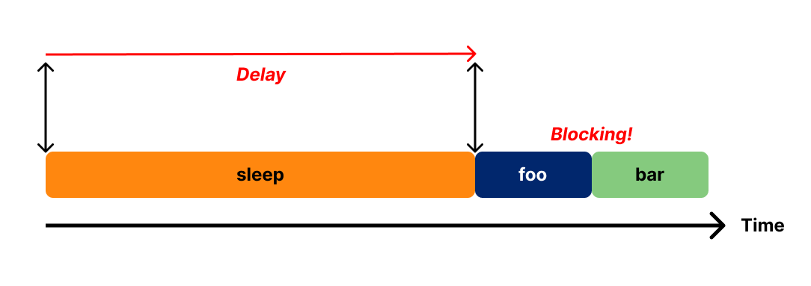
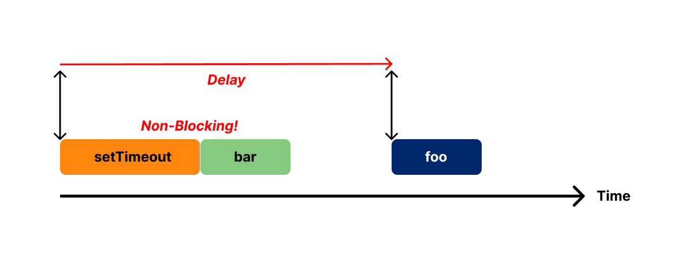
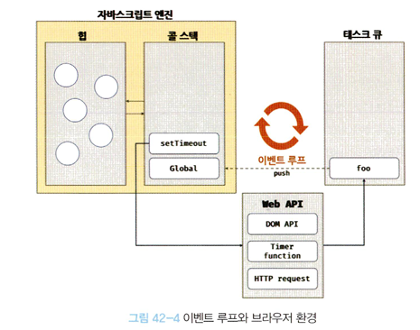

## 1. 동기 처리와 비동기 처리

함수를 호출하면

- 함수 코드가 평가되어
- 함수 실행 컨텍스트가 생성됨
- 실행 컨텍스트 스택(콜 스택)에 푸시 === 함수 실행 시작
- 함수 코드 실행
- 함수 코드 실행이 끝나면
- 함수 실행 컨텍스트는 실행 컨텍스트에서 팝되어 제거됨

<br/>

**자바스크립트 엔진은 단 하나의 실행 컨텍스트 스택을 가짐**

- 함수의 실행 순서는 실행 컨텍스트 스택으로 관리
- 실행 컨텍스트 스택
  - 최상위 요소 "실행 중인 실행 컨텍스트"
  - 실행 대기 중인 task들

<br/>

자바스크립는 **싱글 스레드(single thread)** 방식으로 동작

- 한 번에 하나의 태스크만 실행 가능
- 시간이 걸리는 태스크를 실행하는 경우 **블로킹(작업중단)** 이 발생

**동기(synchronous) 처리**

```javascript
function sleep(func, delay) {
  const delayUntil = Date.now() + delay

  while (Date.now() < delayUntil);
  func()
}

function foo() {
  console.log('foo')
}

function bar() {
  console.log('bar')
}

sleep(foo, 3 * 1000)
bar()
```

- delay 시간만큼 대기함
- 아무것도 수행하지 않는 while문
- foo 함수의 실행 시간 + 3초 동안 호출되지 못하고 블로킹(작업 중단)됨



- 현재 실행 중인 태스크가 종료할 때까지 다음에 실행될 태스크가 대기
- 실행순서가 보장되지만 앞선 태스크가 종료할 때까지 이후 태스크들이 블로킹되는 단점

<br/>

**비동기(asynchoronous) 처리**

```javascript
function foo() {
  console.log('foo')
}

function bar() {
  console.log('bar')
}

setTimeout(foo, 3 * 1000)
bar()
```

- bar 함수가 먼저 호출되고
- 3초 경과 후 foo가 호출됨



- `sleep` 함수와 유사하게 시간이 경과한 후 콜백 함수 호출
- setTimeout 함수 이후의 태스크를 블로킹하지 않고 곧바로 실행
- 태스크가 종료되지 않은 상태라 해도 다음 태스크를 곧바로 실행하는 것

## 2. 이벤트 루프와 태스크 큐

**이벤트 루프**
: 자바스크립트의 동시성(concurrency)을 지원하는 것, 브라우저에 내장되어 있는 기능



<details>
<summary>콜 스택(call stack)</summary>
<div markdown="1">
=> 실행 컨텍스트<br/>
함수를 호출하면 순차적으로 콜 스택에 푸시되어 순차적으로 실행됨<br/>
하나의 콜스택 사용하기 때문에 최상위 실행 컨텍스트가 종료되어 콜 스택에서 제거되기 전까지는 다른 태스크 실행되지 않음
</div>
</details>

<details>
<summary>힙(heap)</summary>
<div markdown="1">
객체가 저장되는 메모리 공간<br/>
콜 스택의 요소인 실행 컨텍스트는 힙에 저장된 객체를 참조함<br/>
값을 저장하려면 저장할 메모리 공간의 크기를 결정해야함<br/>
크기가 정해져 있지 않아서 할당해야 할 메모리 공간의 크기를 런타임에 동적으로 결정함<br/>
-> 메모리 공간이 힙은 구조화 되어 있지 않다는 특징이 있음
</div>
</details>

<details>
<summary>태스크 큐(task queue/event queue/callback queue)</summary>
<div markdown="1">
비동기 함수의 콜백 함수 또는 이벤트 핸들러가 일시적으로 보관되는 영역<br/>
태스크 큐와 별도로 프로미스의 후속 처리 메서드의 콜백 함수가 일시적으로 보관되는 마이크로태스크 큐도 존재함
</div>
</details>
<details>
<summary>이벤트 루프(event loop)</summary>
<div markdown="1">
콜 스택에 현재 실행 중인 실행 컨텍스트가 있는지, 태스크 큐에 대기 중인 함수(콜백함수, 이벤트 핸들러 등)가 있는 지 반복해서 확인<br/>
콜 스택이 비어있고 태스크 큐에 대기중인 함수가 있다면 이벤트 루프틑 순차적(FIFO)으로 태스크 큐에 대기 중인 함수를 콜 스택으로 이동 시킴<br/>
콘 스택으로 이동한 함수는 실행됨<br/>
태스크 큐에 일시 보관된 함수들은 비동기 처리 방식으로 동작함
</div>
</details>

자바스크립트 엔진은 단순히 태스크가 요청되면 콜 스택을 통해 요청된 작업을 순차적으로 실행함<br/>

비동기 처리에서

-> 함수, 소스코드의 평가와 실행 : 자바스크립트 엔진

-> 호출 스케줄링을 위한 타이머 설정과 콜백 함수 등록(소스코드의 평가와 실행을 제외한 모든 처리) : 브라우저 또는 Node.js

<br/>

```javascript
function foo() {
  console.log('foo')
}

function bar() {
  console.log('bar')
}

setTimeout(foo, 0)
bar()
```

1. `setTimeout` 함수 호출, 콜 스택에 푸시
2. `setTimeout` 함수는 Web API이므로 Timer API에서 수행

- 콜백 함수를 스케줄링 === 타이머 설정하고 타이머 만료를 기다림 (브라우저 역할)
- 콜 스택에서 팝 (브라우저 역할)
- delay 시간 뒤에 태스크 큐에 푸시됨 (브라우저 역할)

3. `bar` 함수 호출, 콜 스택에 푸시 (자바스크립트 엔진 역할)
4. `bar` 함수가 콜 스택에서 팝 (자바스크립트 엔진 역할)
5. delay 시간이 지나고 콜백 함수가 태스크 큐에 푸시됨(대기)
6. 이벤트 루프가 콜 스택으로 `foo` 함수를 보냄 -> 콜 스택이 비어 있고 태스크 큐에 대기 중인 함수가 있어야 함
7. 함수를 실행하고 콜 스택에서 팝

- 지연 시간 이후에 콜백 함수가 태스크 큐에 푸시되는 건 맞지만 콜스택이 비어야 호출되므로 delay와 시간차 발생 가능성 o
- 타이머 함수에 지연 시간을 0으로 설정할 경우 최소 지연 시간 4ms가 지정됨

**자바스크립트는 싱글 스레드 방식으로 동작**<br/>
but, 싱글 스레드 방식으로 동작하는 것은 브라우저가 아니라 브라우저에 내장된 자바스크립트 엔진임!<br/>
**브라우저는 멀티 스레드로 동작함!!!** (그래서 비동기 동작이 가능한 것, 브라우저와 자바스크립트 엔진이 협력하여 실행)<br/>

\*Web API - ECMAScript X, 브라우저에서 제공하는 API -> DOM API, 타이머 함수, HTTP 요청과 같은 비동기 처리가 있음

참고 블로그<br/>
[자바스크립트 이벤트 루프 구조 동작 원리](https://inpa.tistory.com/entry/%F0%9F%94%84-%EC%9E%90%EB%B0%94%EC%8A%A4%ED%81%AC%EB%A6%BD%ED%8A%B8-%EC%9D%B4%EB%B2%A4%ED%8A%B8-%EB%A3%A8%ED%94%84-%EA%B5%AC%EC%A1%B0-%EB%8F%99%EC%9E%91-%EC%9B%90%EB%A6%AC)
