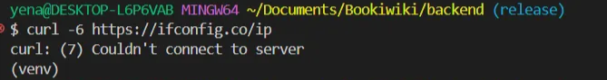
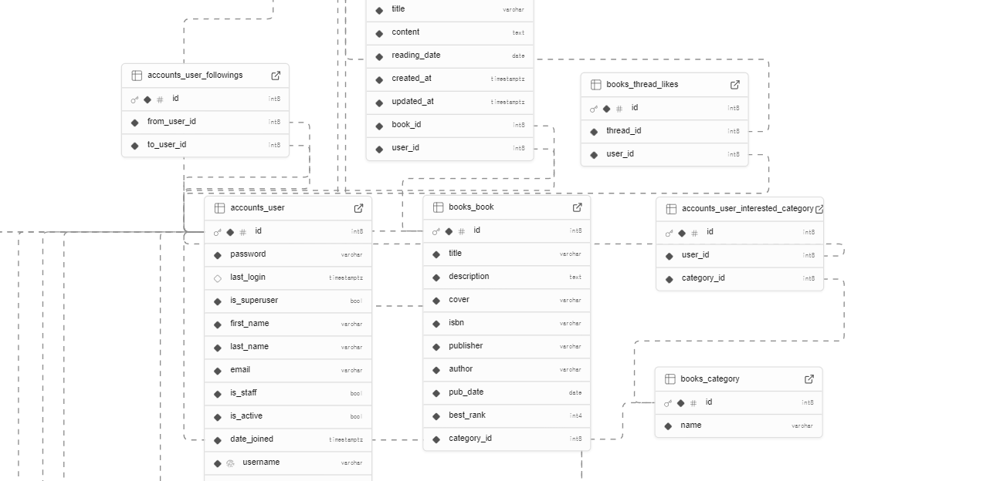
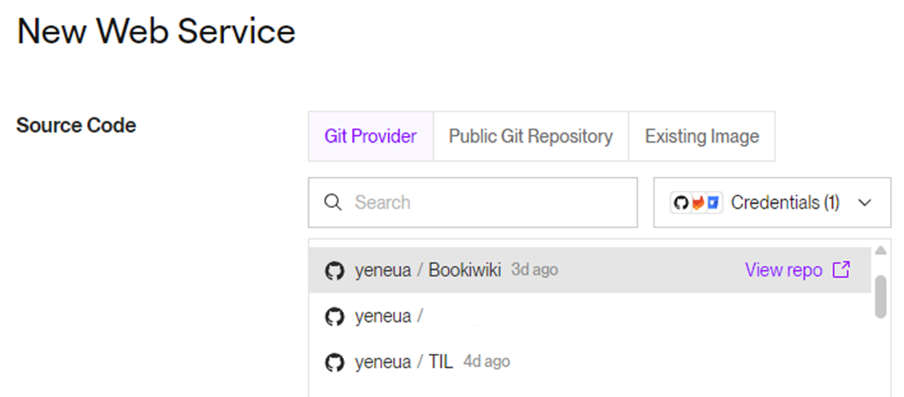
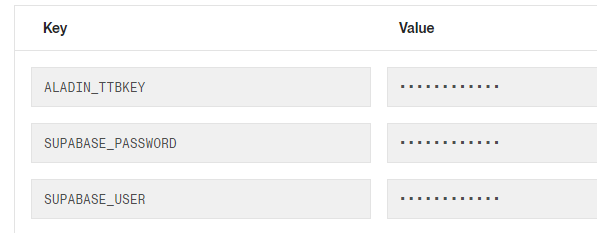
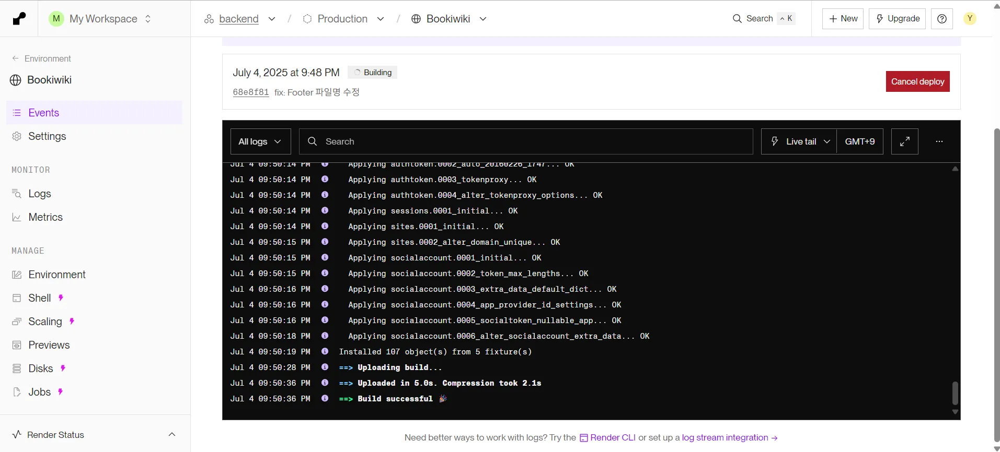

관통 프로젝트 배포하기!!

# DB

## 왜?

배포된 프로젝트를 진행해 본 경험은 있지만 내가 배포를 직접 경험해 본 적은 없었다. 배포 관련해서 아는 게 많이 없었기 때문에 supabse를 사용하면 간단하게 db를 올릴 수 있다는 얘기를 듣고 사용해 보면 좋을 것 같다는 생각이 들었다.<br/>
그래서 찾아본 supabase란?

- Baas(Backend as a Service); 서비스형 백엔드
- 백엔드 기능을 쉽고 빠르게 구축할 수 있도록 다양한 서비스 제공
- Firebase의 대안으로 자주 언급됨
- DB, 인증, 스토리지, 실시간 기능 등 백엔드 개발에 필요한 요소 제공
- PostgreSQL 기반 관계형 DB 제공
  -> bookiwiki의 기존 DB를 그대로 유지하면서 개발하려면 supabase가 적절한 선택!

## 과정

1. Supabase에서 project 생성
2. `psycopg2-binary` 라이브러리 설치 : python에서 PostgreSQL DB를 연결하고 실행하기 위한 라이브러리
3. connect -> Connection String 내용 django `settings.py`에 작성

```python
DATABASES = {
    "default": {
        "ENGINE": "django.db.backends.postgresql",
        "NAME": "Connection parameters의 Database name",
        "USER": "Connection parameters의 User",
        "PASSWORD": "프로젝트 생성할 때 비밀번호",
        "HOST": "Connection parameters의 Host",
        "PORT": "Connection parameters의 Port",
    }
}
```

**⚠️ 에러 발생**

- 위처럼 코드를 작성하고 `migrations`를 했을 때 해당 에러 발생

`UnicodeDecodeError: 'utf-8' codec can't decode byte 0xbe in position 80: invalid start byte`

- 데이터 파일을 utf-8 형식으로 저장해 보고
- 비밀번호에 특수문자를 제외하고도 작성해 보고
- 직접 하드코딩해서 테스트했음에도 여전히 같은 오류 발생

**... 수많은 구글링 후 네트워크 문제임을 알게 됨!**


로컬에서 IPv6로 연결이 불가능했음<br/><span style="color: #808080">에러 원인을 찾는 데 한참이 걸렸다 ...</span><br/>
-> supabase의 Trasaction Pooler로 바꿔서 연결 성공<br/>
이전에 작성한 Direct connection 대신 Transaction Pooler로 바꿔서 작성<br/>
(Transaction Pooler는 Ipv4 우선)

```python
DATABASES = {
    "default": {
            "ENGINE": "django.db.backends.postgresql",
            "NAME": "postgres",
            "USER": SUPABASE_USER,
            "PASSWORD": SUPABASE_PASSWORD,
            "HOST": "aws-0-ap-northeast-2.pooler.supabase.com",
            "PORT": "5432",
            "OPTIONS" : {
                'sslmode' : 'require'
            }
    }
}
```

4. `makemigrations`, `migrate` 명령어 입력


이렇게 DB가 잘 올라간 것을 확인할 수 있다!

# 백엔드

## 왜?

1. 간편함

- github 저장소와 쉬운 연동
- 복잡한 설정 X
- 코드 푸시 하면 자동 배포

2. 비용

- 무료 플랜으로도 bookiwiki 프로젝트 운영이 가능하다고 판단

## 과정

1. render 가입 후 web service 생성
2. github 레포지토리 연동

   

3. 지역, 언어 선택
   <br/> **⭐ `requirements.txt`와 `manage.py`가 최상단에 위치해야 함**<br/>
   따라서 Bookiwiki 프로젝트 구조에 맞게 Root Directory를 `backend/`로 지정

4. build command 작성<br/>
   `pip install -r requirements.txt && python manage.py makemigrations && python manage.py migrate && python manage.py loaddata categories.json books.json threads.json comments.json users.json`
5. start command 작성<br/>
   `python manage.py runserver`

**⚠️ 배포가 되지 않는 문제 발생**

a. `ALLOWED_HOSTS` 설정<br/>
`ALLOWED_HOSTS = ['bookiwiki.onrender.com', 'localhost', '127.0.0.1']`

- 배포된 서버 주소 허용

b. cors 설정

```python
CORS_ALLOWED_ORIGINS = [
  'http://127.0.0.1:5173',
  'http://localhost:5173',
  'https://bookiwiki.vercel.app',
]
```

c. `DEBUG = False`

- 운영 환경에서는 위 설정 必
- True로 설정되어 있을 경우 디버깅 정보를 그대로 화면에 출력
- 보안상 민감한 정보 노출될 가능성

d. 패키지 설치

- `gunicorn` : Render에서 django를 실행할 수 있도록 해주는 WSGI 서버
- `packaging` : 내부 의존성 관리 및 버전 비교를 위한 라이브러리

- 배포 환경과 로컬 환경에서 api 호출이 가능하도록 설정

e. start command 수정

- `python manage.py runserver`는 개발 환경 전용
- `gunicorn api.wsgi:application --bind 0.0.0.0:$PORT`
  - `api/wsgi.py` 경로에 위치한 `wsgi.py`의 `application`객체 실행
  - 모든 IP에서 접근 가능한 상태로 서버 실행

6.  환경 변수 설정

    

모든 설정을 다 마치면 배포 로그를 바로 확인할 수 있고 빌드가 성공된 것을 볼 수 있다 ㅎㅎ



# 프론트
