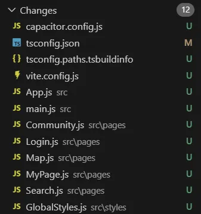
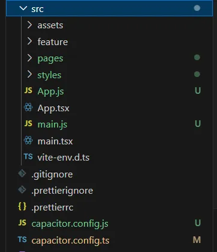
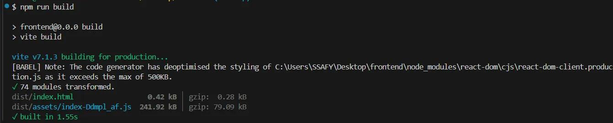
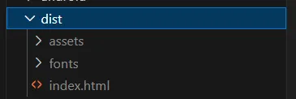

## 에러 발생 상황

```bash
# 1. capacitor 패키지 설치
npm i @capacitor/core
npm i -D @capacitor/cli

# 2. capacitor 프로젝트 초기화
npx cap init # appName, appId, webDir 입력(vite일 경우 dist)

# 3. 플랫폼 추가
npm i @capacitor/android
npx cap add android

# 4. react 앱 빌드
npm run build

# 5. capacitor에 빌드 결과물 복사
npx cap sync
```

react 프로젝트에 capacitor를 적용하려면 위와 같은 과정을 거쳐야하는데 4번 앱 빌드에서 오류가 남

<details>
<summary>에러 전문</summary>

```text
node_modules/react-router-dom/dist/index.d.ts:1:69 - error TS2307: Cannot find module 'react-router/dom' or its corresponding type declarations.
  There are types at 'C:/Users/SSAFY/Desktop/frontend/node_modules/react-router/dist/development/dom-export.d.mts', but this result could not be resolved under your current 'moduleResolution' setting. Consider updating to 'node16', 'nodenext', or 'bundler'.

1 export { HydratedRouter, RouterProvider, RouterProviderProps } from 'react-router/dom';
                                                                      ~~~~~~~~~~~~~~~~~~

node_modules/react-router/dist/development/index.d.ts:4:8 - error TS1259: Module '"C:/Users/SSAFY/Desktop/frontend/node_modules/@types/react/index"' can only be default-imported using the 'esModuleInterop' flag

4 import React__default, { ReactElement } from 'react';
         ~~~~~~~~~~~~~~

  node_modules/@types/react/index.d.ts:66:1
    66 export = React;
       ~~~~~~~~~~~~~~~
    This module is declared with 'export =', and can only be used with a default import when using the 'esModuleInterop' flag.

node_modules/react-router/dist/development/routeModules-rOzWJJ9x.d.ts:364:5 - error TS18028: Private identifiers are only available when targeting ECMAScript 2015 and higher.

364     #private;
        ~~~~~~~~

node_modules/vite/dist/node/index.d.ts:7:41 - error TS2307: Cannot find module 'rollup/parseAst' or its corresponding type declarations.
  There are types at 'C:/Users/SSAFY/Desktop/frontend/node_modules/rollup/dist/parseAst.d.ts', but this result could not be resolved under your current 'moduleResolution' setting. Consider updating to 'node16', 'nodenext', or 'bundler'.

7 import { parseAst, parseAstAsync } from "rollup/parseAst";
                                          ~~~~~~~~~~~~~~~~~

src/App.tsx:2:19 - error TS6142: Module '@/pages/Login' was resolved to 'C:/Users/SSAFY/Desktop/frontend/src/pages/Login.tsx', but '--jsx' is not set.

2 import Login from '@/pages/Login'
                    ~~~~~~~~~~~~~~~

src/App.tsx:3:20 - error TS6142: Module '@/pages/MyPage' was resolved to 'C:/Users/SSAFY/Desktop/frontend/src/pages/MyPage.tsx', but '--jsx' is not set.

3 import MyPage from '@/pages/MyPage'
                     ~~~~~~~~~~~~~~~~

src/App.tsx:4:17 - error TS6142: Module '@/pages/Map' was resolved to 'C:/Users/SSAFY/Desktop/frontend/src/pages/Map.tsx', but '--jsx' is not set.

4 import Map from '@/pages/Map'
                  ~~~~~~~~~~~~~

src/App.tsx:5:20 - error TS6142: Module '@/pages/Search' was resolved to 'C:/Users/SSAFY/Desktop/frontend/src/pages/Search.tsx', but '--jsx' is not set.

5 import Search from '@/pages/Search'
                     ~~~~~~~~~~~~~~~~

src/App.tsx:6:23 - error TS6142: Module '@/pages/Community' was resolved to 'C:/Users/SSAFY/Desktop/frontend/src/pages/Community.tsx', but '--jsx' is not set.

6 import Community from '@/pages/Community'
                        ~~~~~~~~~~~~~~~~~~~

src/App.tsx:10:5 - error TS17004: Cannot use JSX unless the '--jsx' flag is provided.

10     <>
       ~~

src/App.tsx:11:7 - error TS17004: Cannot use JSX unless the '--jsx' flag is provided.

11       <Routes>
         ~~~~~~~~

src/App.tsx:12:9 - error TS17004: Cannot use JSX unless the '--jsx' flag is provided.

12         <Route path="/login" element={<Login />} />
           ~~~~~~~~~~~~~~~~~~~~~~~~~~~~~~~~~~~~~~~~~~~

src/App.tsx:12:39 - error TS17004: Cannot use JSX unless the '--jsx' flag is provided.

12         <Route path="/login" element={<Login />} />
                                         ~~~~~~~~~

src/App.tsx:13:9 - error TS17004: Cannot use JSX unless the '--jsx' flag is provided.

13         <Route path="/mypage" element={<MyPage />} />
           ~~~~~~~~~~~~~~~~~~~~~~~~~~~~~~~~~~~~~~~~~~~~~

src/App.tsx:13:40 - error TS17004: Cannot use JSX unless the '--jsx' flag is provided.

13         <Route path="/mypage" element={<MyPage />} />
                                          ~~~~~~~~~~

src/App.tsx:14:9 - error TS17004: Cannot use JSX unless the '--jsx' flag is provided.

14         <Route path="/map" element={<Map />} />
           ~~~~~~~~~~~~~~~~~~~~~~~~~~~~~~~~~~~~~~~

src/App.tsx:14:37 - error TS17004: Cannot use JSX unless the '--jsx' flag is provided.

14         <Route path="/map" element={<Map />} />
                                       ~~~~~~~

src/App.tsx:15:9 - error TS17004: Cannot use JSX unless the '--jsx' flag is provided.

15         <Route path="/search" element={<Search />} />
           ~~~~~~~~~~~~~~~~~~~~~~~~~~~~~~~~~~~~~~~~~~~~~

src/App.tsx:15:40 - error TS17004: Cannot use JSX unless the '--jsx' flag is provided.

15         <Route path="/search" element={<Search />} />
                                          ~~~~~~~~~~

src/App.tsx:16:9 - error TS17004: Cannot use JSX unless the '--jsx' flag is provided.

16         <Route path="/community" element={<Community />} />
           ~~~~~~~~~~~~~~~~~~~~~~~~~~~~~~~~~~~~~~~~~~~~~~~~~~~

src/App.tsx:16:43 - error TS17004: Cannot use JSX unless the '--jsx' flag is provided.

16         <Route path="/community" element={<Community />} />
                                             ~~~~~~~~~~~~~

src/main.tsx:4:17 - error TS6142: Module '@/App' was resolved to 'C:/Users/SSAFY/Desktop/frontend/src/App.tsx', but '--jsx' is not set.

4 import App from '@/App'
                  ~~~~~~~

src/main.tsx:5:26 - error TS5097: An import path can only end with a '.tsx' extension when 'allowImportingTsExtensions' is enabled.

5 import GlobalStyles from '@/styles/GlobalStyles.tsx'
                           ~~~~~~~~~~~~~~~~~~~~~~~~~~~

src/main.tsx:5:26 - error TS6142: Module '@/styles/GlobalStyles.tsx' was resolved to 'C:/Users/SSAFY/Desktop/frontend/src/styles/GlobalStyles.tsx', but '--jsx' is not set.

5 import GlobalStyles from '@/styles/GlobalStyles.tsx'
                           ~~~~~~~~~~~~~~~~~~~~~~~~~~~

src/main.tsx:8:3 - error TS17004: Cannot use JSX unless the '--jsx' flag is provided.

8   <StrictMode>
    ~~~~~~~~~~~~

src/main.tsx:9:5 - error TS17004: Cannot use JSX unless the '--jsx' flag is provided.

9     <>
      ~~

src/main.tsx:10:7 - error TS17004: Cannot use JSX unless the '--jsx' flag is provided.

10       <BrowserRouter>
         ~~~~~~~~~~~~~~~

src/main.tsx:11:9 - error TS17004: Cannot use JSX unless the '--jsx' flag is provided.

11         <GlobalStyles />
           ~~~~~~~~~~~~~~~~

src/main.tsx:12:9 - error TS17004: Cannot use JSX unless the '--jsx' flag is provided.

12         <App />
           ~~~~~~~

src/pages/Community.tsx:2:10 - error TS17004: Cannot use JSX unless the '--jsx' flag is provided.

2   return <div>Community</div>
           ~~~~~

src/pages/Login.tsx:2:10 - error TS17004: Cannot use JSX unless the '--jsx' flag is provided.

2   return <div>Login</div>
           ~~~~~

src/pages/Map.tsx:2:10 - error TS17004: Cannot use JSX unless the '--jsx' flag is provided.

2   return <div>Map</div>
           ~~~~~

src/pages/MyPage.tsx:2:10 - error TS17004: Cannot use JSX unless the '--jsx' flag is provided.

2   return <div>MyPage</div>
           ~~~~~

src/pages/Search.tsx:2:10 - error TS17004: Cannot use JSX unless the '--jsx' flag is provided.

2   return <div>Search</div>
           ~~~~~

src/styles/GlobalStyles.tsx:4:3 - error TS17004: Cannot use JSX unless the '--jsx' flag is provided.

  4   <Global
      ~~~~~~~
  5     styles={css`
    ~~~~~~~~~~~~~~~~
...
 81     `}
    ~~~~~~
 82   />
    ~~~~

vite.config.ts:2:19 - error TS2307: Cannot find module '@vitejs/plugin-react' or its corresponding type declarations.
  There are types at 'C:/Users/SSAFY/Desktop/frontend/node_modules/@vitejs/plugin-react/dist/index.d.ts', but this result could not be resolved under your current 'moduleResolution' setting. Consider updating to 'node16', 'nodenext', or 'bundler'.

2 import react from '@vitejs/plugin-react'
                    ~~~~~~~~~~~~~~~~~~~~~~

vite.config.ts:4:8 - error TS1259: Module '"node:path"' can only be default-imported using the 'esModuleInterop' flag
4 import path from 'node:path'
         ~~~~

  node_modules/@types/node/path.d.ts:191:5
    191     export = path;
            ~~~~~~~~~~~~~~
    This module is declared with 'export =', and can only be used with a default import when using the 'esModuleInterop' flag.


Found 37 errors.
```

</details>
<br/>
그리고 ts로 적힌 파일들이 모두 js로 바뀌어 버림



## 트러블 슈팅

**tsc 설정 문제**

`npm run build`를 하면 결과물이 `build/` `dist/` 같은 output 디렉토리에 생긴다고 함

근데 그냥 ts 파일들이 js로 바뀜

<br/>

👉 `tsconfig.json` 파일 경로 지정해주기

```json
{
  "compilerOptions": {
    "outDir": "dist",
    "rootDir": "src",
    "noEmit": true // 보통 React/Vite/CRA 쓸 때는 이 옵션을 켜둬서 js 산출물 자체를 만들지 않음
  }
}
```

<br/>

⚠️ **ts 파일이 js로 바뀌지는 않는데 js 파일이 dist 폴더에 안 생김. dist 폴더가 안 생긴다!**



<br/>

👉 `vite.config.ts` 파일에도 build 설정해줌

```tsx
import { defineConfig } from 'vite'
import react from '@vitejs/plugin-react'
import babel from 'vite-plugin-babel'
import path from 'node:path'

// https://vite.dev/config/
export default defineConfig({
  plugins: [
    react(),
    babel({
      babelConfig: {
        plugins: ['@emotion/babel-plugin'],
      },
    }),
  ],
  **build: {
    outDir: 'dist',
  },**
  resolve: {
    alias: {
      '@styles': path.resolve(__dirname, './src/styles'),
      '@': path.resolve(__dirname, './src'),
    },
  },
})
```

<br/>

👉 `npx vite build`로 에러 로그 확인


어라라 문제 없다네 다시 `npm run build` 시도

<br/>

⚠️ **근데 여전히 타입 오류가 남**

<details>
<summary>에러 전문</summary>

```text
node_modules/react-router-dom/dist/index.d.ts:1:69 - error TS2307: Cannot find module 'react-router/dom' or its corresponding type declarations.
  There are types at 'C:/Users/SSAFY/Desktop/frontend/node_modules/react-router/dist/development/dom-export.d.mts', but this result could not be resolved under your current 'moduleResolution' setting. Consider updating to 'node16', 'nodenext', or 'bundler'.

1 export { HydratedRouter, RouterProvider, RouterProviderProps } from 'react-router/dom';
                                                                      ~~~~~~~~~~~~~~~~~~

node_modules/react-router/dist/development/index.d.ts:4:8 - error TS1259: Module '"C:/Users/SSAFY/Desktop/frontend/node_modules/@types/react/index"' can only be default-imported using the 'esModuleInterop' flag

4 import React__default, { ReactElement } from 'react';
         ~~~~~~~~~~~~~~

  node_modules/@types/react/index.d.ts:66:1
    66 export = React;
       ~~~~~~~~~~~~~~~
    This module is declared with 'export =', and can only be used with a default import when using the 'esModuleInterop' flag.

node_modules/react-router/dist/development/routeModules-rOzWJJ9x.d.ts:364:5 - error TS18028: Private identifiers are only available when targeting ECMAScript 2015 and higher.

364     #private;
        ~~~~~~~~

node_modules/vite/dist/node/index.d.ts:7:41 - error TS2307: Cannot find module 'rollup/parseAst' or its corresponding type declarations.
  There are types at 'C:/Users/SSAFY/Desktop/frontend/node_modules/rollup/dist/parseAst.d.ts', but this result could not be resolved under your current 'moduleResolution' setting. Consider updating to 'node16', 'nodenext', or 'bundler'.

7 import { parseAst, parseAstAsync } from "rollup/parseAst";
                                          ~~~~~~~~~~~~~~~~~

src/App.tsx:2:19 - error TS6142: Module '@/pages/Login' was resolved to 'C:/Users/SSAFY/Desktop/frontend/src/pages/Login.tsx', but '--jsx' is not set.

2 import Login from '@/pages/Login'
                    ~~~~~~~~~~~~~~~

src/App.tsx:3:20 - error TS6142: Module '@/pages/MyPage' was resolved to 'C:/Users/SSAFY/Desktop/frontend/src/pages/MyPage.tsx', but '--jsx' is not set.

3 import MyPage from '@/pages/MyPage'
                     ~~~~~~~~~~~~~~~~

src/App.tsx:4:17 - error TS6142: Module '@/pages/Map' was resolved to 'C:/Users/SSAFY/Desktop/frontend/src/pages/Map.tsx', but '--jsx' is not set.

4 import Map from '@/pages/Map'
                  ~~~~~~~~~~~~~

src/App.tsx:5:20 - error TS6142: Module '@/pages/Search' was resolved to 'C:/Users/SSAFY/Desktop/frontend/src/pages/Search.tsx', but '--jsx' is not set.

5 import Search from '@/pages/Search'
                     ~~~~~~~~~~~~~~~~

src/App.tsx:6:23 - error TS6142: Module '@/pages/Community' was resolved to 'C:/Users/SSAFY/Desktop/frontend/src/pages/Community.tsx', but '--jsx' is not set.

6 import Community from '@/pages/Community'
                        ~~~~~~~~~~~~~~~~~~~

src/App.tsx:10:5 - error TS17004: Cannot use JSX unless the '--jsx' flag is provided.

10     <>
       ~~

src/App.tsx:11:7 - error TS17004: Cannot use JSX unless the '--jsx' flag is provided.

11       <Routes>
         ~~~~~~~~

src/App.tsx:12:9 - error TS17004: Cannot use JSX unless the '--jsx' flag is provided.

12         <Route path="/login" element={<Login />} />
           ~~~~~~~~~~~~~~~~~~~~~~~~~~~~~~~~~~~~~~~~~~~

src/App.tsx:12:39 - error TS17004: Cannot use JSX unless the '--jsx' flag is provided.

12         <Route path="/login" element={<Login />} />
                                         ~~~~~~~~~

src/App.tsx:13:9 - error TS17004: Cannot use JSX unless the '--jsx' flag is provided.

13         <Route path="/mypage" element={<MyPage />} />
           ~~~~~~~~~~~~~~~~~~~~~~~~~~~~~~~~~~~~~~~~~~~~~

src/App.tsx:13:40 - error TS17004: Cannot use JSX unless the '--jsx' flag is provided.

13         <Route path="/mypage" element={<MyPage />} />
                                          ~~~~~~~~~~

src/App.tsx:14:9 - error TS17004: Cannot use JSX unless the '--jsx' flag is provided.

14         <Route path="/map" element={<Map />} />
           ~~~~~~~~~~~~~~~~~~~~~~~~~~~~~~~~~~~~~~~

src/App.tsx:14:37 - error TS17004: Cannot use JSX unless the '--jsx' flag is provided.

14         <Route path="/map" element={<Map />} />
                                       ~~~~~~~

src/App.tsx:15:9 - error TS17004: Cannot use JSX unless the '--jsx' flag is provided.

15         <Route path="/search" element={<Search />} />
           ~~~~~~~~~~~~~~~~~~~~~~~~~~~~~~~~~~~~~~~~~~~~~

src/App.tsx:15:40 - error TS17004: Cannot use JSX unless the '--jsx' flag is provided.

15         <Route path="/search" element={<Search />} />
                                          ~~~~~~~~~~

src/App.tsx:16:9 - error TS17004: Cannot use JSX unless the '--jsx' flag is provided.

16         <Route path="/community" element={<Community />} />
           ~~~~~~~~~~~~~~~~~~~~~~~~~~~~~~~~~~~~~~~~~~~~~~~~~~~

src/App.tsx:16:43 - error TS17004: Cannot use JSX unless the '--jsx' flag is provided.

16         <Route path="/community" element={<Community />} />
                                             ~~~~~~~~~~~~~

src/main.tsx:4:17 - error TS6142: Module '@/App' was resolved to 'C:/Users/SSAFY/Desktop/frontend/src/App.tsx', but '--jsx' is not set.

4 import App from '@/App'
                  ~~~~~~~

src/main.tsx:5:26 - error TS5097: An import path can only end with a '.tsx' extension when 'allowImportingTsExtensions' is enabled.

5 import GlobalStyles from '@/styles/GlobalStyles.tsx'
                           ~~~~~~~~~~~~~~~~~~~~~~~~~~~

src/main.tsx:5:26 - error TS6142: Module '@/styles/GlobalStyles.tsx' was resolved to 'C:/Users/SSAFY/Desktop/frontend/src/styles/GlobalStyles.tsx', but '--jsx' is not set.

5 import GlobalStyles from '@/styles/GlobalStyles.tsx'
                           ~~~~~~~~~~~~~~~~~~~~~~~~~~~

src/main.tsx:8:3 - error TS17004: Cannot use JSX unless the '--jsx' flag is provided.

8   <StrictMode>
    ~~~~~~~~~~~~

src/main.tsx:9:5 - error TS17004: Cannot use JSX unless the '--jsx' flag is provided.

9     <>
      ~~

src/main.tsx:10:7 - error TS17004: Cannot use JSX unless the '--jsx' flag is provided.

10       <BrowserRouter>
         ~~~~~~~~~~~~~~~

src/main.tsx:11:9 - error TS17004: Cannot use JSX unless the '--jsx' flag is provided.

11         <GlobalStyles />
           ~~~~~~~~~~~~~~~~

src/main.tsx:12:9 - error TS17004: Cannot use JSX unless the '--jsx' flag is provided.

12         <App />
           ~~~~~~~

src/pages/Community.tsx:2:10 - error TS17004: Cannot use JSX unless the '--jsx' flag is provided.

2   return <div>Community</div>
           ~~~~~

src/pages/Login.tsx:2:10 - error TS17004: Cannot use JSX unless the '--jsx' flag is provided.

2   return <div>Login</div>
           ~~~~~

src/pages/Map.tsx:2:10 - error TS17004: Cannot use JSX unless the '--jsx' flag is provided.

2   return <div>Map</div>
           ~~~~~

src/pages/MyPage.tsx:2:10 - error TS17004: Cannot use JSX unless the '--jsx' flag is provided.

2   return <div>MyPage</div>
           ~~~~~

src/pages/Search.tsx:2:10 - error TS17004: Cannot use JSX unless the '--jsx' flag is provided.

2   return <div>Search</div>
           ~~~~~

src/styles/GlobalStyles.tsx:4:3 - error TS17004: Cannot use JSX unless the '--jsx' flag is provided.

  4   <Global
      ~~~~~~~
  5     styles={css`
    ~~~~~~~~~~~~~~~~
...
 81     `}
    ~~~~~~
 82   />
    ~~~~

vite.config.ts:2:19 - error TS2307: Cannot find module '@vitejs/plugin-react' or its corresponding type declarations.
  There are types at 'C:/Users/SSAFY/Desktop/frontend/node_modules/@vitejs/plugin-react/dist/index.d.ts', but this result could not be resolved under your current 'moduleResolution' setting. Consider updating to 'node16', 'nodenext', or 'bundler'.

2 import react from '@vitejs/plugin-react'
                    ~~~~~~~~~~~~~~~~~~~~~~

vite.config.ts:4:8 - error TS1259: Module '"node:path"' can only be default-imported using the 'esModuleInterop' flag
4 import path from 'node:path'
         ~~~~

  node_modules/@types/node/path.d.ts:191:5
    191     export = path;
            ~~~~~~~~~~~~~~
    This module is declared with 'export =', and can only be used with a default import when using the 'esModuleInterop' flag.


Found 37 errors.

```

</details>

`npm run build`는 `tsc -b` (타입스크립트 빌드)도 같이 돌기 때문에 `npx vite build`만 돌릴 때는 성공했던 것임

→ vite는 자체 번들러만 써서 ts 설정 충돌 X

<br/>

👉 타입 체크 따로 분리하기 → `package.json` 수정

```json
{
  "scripts": {
    "dev": "vite",
    "build": "vite build", // "build" : "tsc -b && vite build"
    "typecheck": "tsc -b"
  }
}
```

- 타입 체크 시 : `npm run typecheck`
- 배포 전 빌드 : `npm run build`

✅ **`dist/` 폴더 생성됨**





**❓ src 폴더 파일들은 어디에 생기나요**

빌드 결과물인 `dist/` 폴더에는 브라우저가 실행할 수 있는 파일들만 들어감
