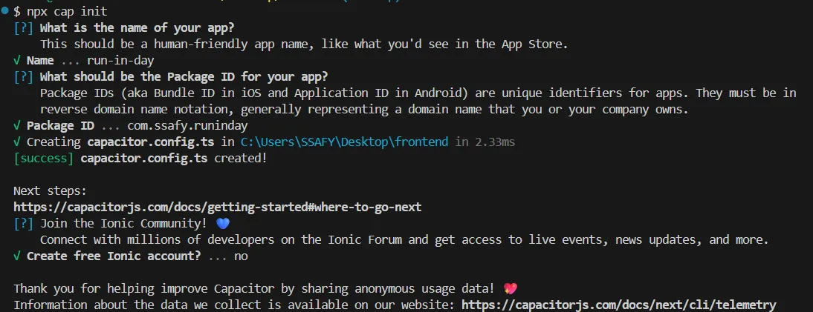
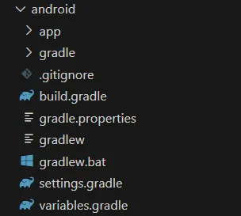
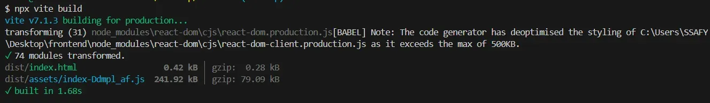
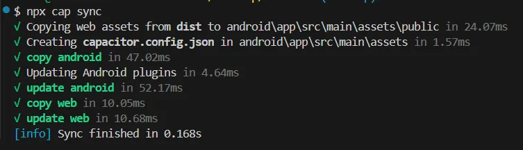

# 사용하기

- 웹 코드만 수정했을 경우
  ```bash
  npm run build
  npx cap copy build
  ```
  - capacitor 설치 이미 했고 import 해서 불러오는 상황이면 copy만 해도 됨
- capacitor 설정/플러그인 변경한 경우
  ```bash
  npm run build
  npx cap sync android
  ```
  - 플러그인을 새로 설치/삭제한 경우
  - `capacitor.config.ts` 설정 바꾼 경우
  - 위 명령어로 네이티브 프로젝트에 반영 해줘야 함

❓플러그인 설치 할 때마다 `sync`를 해야 하나? 쭉 개발하다가 배포 전에 하면 되나?

→ 주요 기능 완성하고 `npm run build` 하는 것 추천. 매번 플러그인 설치할 때마다 `sync` 안해도 됨. 여러 플러그인 한 번에 설치하고 마지막에 `sync`해서 동기화하는 것도 가능. 중간 중간에 수시로 sync 해서 테스트 해보는 게 좋다. 마지막에 에러 몰릴 위험 존재

# capacitor 적용하기

## 환경 설정

### 1. node 설치

```bash
node --version
# v22.18.0 -> 25.08.25 기준 LTS
```

### 2. 안드로이드일 경우

1. Android Studio
   - capacitor 7 → android studio 2024.2.1 이상 필요
2. Android SDK
   - API 23 이상 버전 필요

## react 프로젝트에 capacitor 추가하기

```bash
# 1. capacitor 패키지 설치
npm i @capacitor/core
npm i -D @capacitor/cli

# 2. capacitor 프로젝트 초기화
npx cap init # appName, appId, webDir 입력(vite일 경우 dist)

# 3. 플랫폼 추가
npm i @capacitor/android
npx cap add android

# 4. react 앱 빌드
npm run build

# 5. capacitor에 빌드 결과물 복사
npx cap sync
```

1. `npx cap init`

   - capacitor 프로젝트 초기화 할 때 실행
   - `capacitor.config.ts` 파일을 만들어줌
     - 앱 이름, 아이디, 웹 자산 위치가 여기에 기록됨(네이티브 앱으로 어떻게 감쌀지 기본 설정을 등록)
   - 기본 설정 지정함(`appId`, `appName`, `webDir`)

     

     ````tsx
     // capacitor.config.ts 파일
     import type { CapacitorConfig } from '@capacitor/cli'

     const config: CapacitorConfig = {
     appId: 'com.ssafy.runinday',
     appName: 'run-in-day',
     webDir: 'dist',
     }

     export default config
     ```~
     ````

2. `npx cap add android`

   - capacitor 프로젝트에 android 플랫폼 추가해줌
   - 이때 react를 네이티브 앱으로 감싸는 구조가 됨
     - 웹 자산을 복사해 넣는 구조라서 이 단계가 필요

   android 폴더 생성됨

   

3. `npm run build` + `npx cap sync`

   → Capactior는 ‘정적 빌드 결과물(dist/)’를 WebView에 넣어야 함

   → 반드시 빌드해야 네이티브 앱에서 실행 가능

   → `npx cap sync` : 빌드 산출물을 네이티브 프로젝트로 복사. 웹 코드와 네이티브 껍데기의 상태를 동기화

   - react 빌드하고
   - 앱 실행됨
     

     

     

✅ `npm run build` + `npx cap sync` 언제 실행해야 하나?

| 상황                                                                      | `npm run build`   | `npx cap sync`      |
| ------------------------------------------------------------------------- | ----------------- | ------------------- |
| **React 코드 변경** (UI, 로직 등)                                         | ✅ 꼭 실행해야 함 | ✅ 함께 실행해야 함 |
| **Capacitor 관련 설정 변경**(예: `capacitor.config.ts`, 플러그인 추가 등) | ❌ 필요 없음      | ✅ 꼭 실행해야 함   |
| **Android 프로젝트 생성 직후 or 업데이트**                                | ✅ 한 번 실행     | ✅ 한 번 실행       |
| **React 코드만 수정** (예: 화면 변경)                                     | ✅ 매번 필요      | ✅ 매번 필요        |
| **앱 배포용으로 빌드할 때**                                               | ✅ 필요           | ✅ 필요             |

## 참고한 글

[Capacitor - Cross-platform Native Runtime for Web Apps | Capacitor Documentation](https://capacitorjs.com/docs)

[시리즈 | React에서 Capacitor 사용하기 - jypapapaa.log](https://velog.io/@jypapapaa/series/React%EC%97%90%EC%84%9C-Capacitor-%EC%82%AC%EC%9A%A9%ED%95%98%EA%B8%B0)
