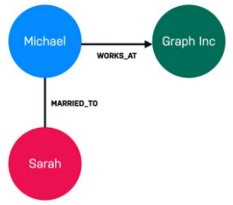
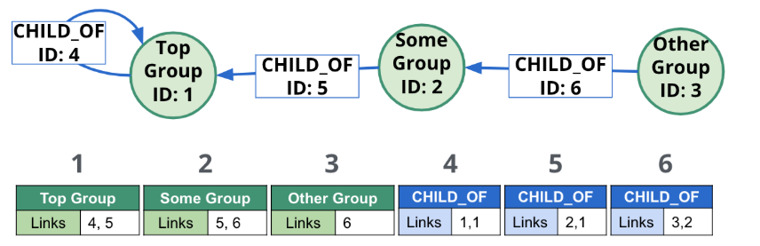
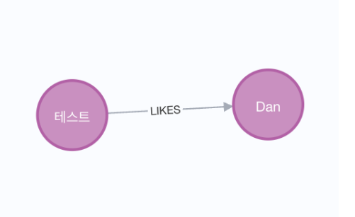

## Neo4j

- 그래프 DBMS
- Cypher라는 선언전 그래프 쿼리 언어 사용

**그래프형 DB란?**

- 노드(Nodes)와 간선(Relationship)으로 구성되어 있는 데이터베이스

  

  - A, B는 works_at 관계로 연결
  - A, C는 married_to 관계로 연결

### 특징

- RDBMS에 비해 속도가 빠름



- 노드와 관계를 포인터를 통해 서로 연결된 객체로 저장함
- 포인터 << 다음으로 이동할 노드 주소를 알고 있음

**동작 과정: 포인터로 접근**

> 3번 노드의 조상을 찾는 경우

1. 블록 3번에서 탐색 시작
2. 포인터를 따라 블록 6으로 이동
3. 블록 6 탐색 -> '3번'에서 왔으므로 반대편인 블록 2로 이동
4. 블록 2 탐색 -> '6번'에서 왔으므로 반대편인 블록 5로 이동
5. 블록 5 탐색 -> '2번'에서 왔으므로 반대편인 블록 1로 이동
6. 블록 1 탐색 -> '5번'에서 왔으므로 반대편인 블록 4로 이동
7. 블록 4 탐색 -> 다음 포인터는 1번인 것을 알 수 있음

### Cypher 쿼리

> Neo4j에서는 SQL이 아닌 Cypher라는 선언형 프로그래밍 언어를 통해 질의

**1. Node 생성**

```
CREATE(p:Person name: 'Emil', from: 'Sweden')
CREATE (p:Person {name: 'Dan'})
```

**2. Relationship 추가**

```
MATCH (a:Person {name:'Emil'}),(b:Person{name: 'Dan'})
CREATE (a)-[r:LIKES]->(b)
RETURN r
```



**3. 조회**

`MATCH`: 데이터베이스에 저장되어 있는 노드나 관계를 찾아올 때 사용

i. 특정 노드 찾기

```
MATCH (p:Person {name: 'Alice'})
RETURN p
```

ii. 특정 라벨 모든 노드 찾기

- `Person` 라벨을 가지고 `name`이 `'Alice'`인 노드를 찾음

```
MATCH (p:Person)
RETURN p
```

iii. 관계가 있는 노드 찾기

- `'Alice'`라는 사람이 FRIENDS_WITH (친구) 관계로 연결된 다른 모든 노드(친구들)를 찾아 반환

```
MATCH (alice:Person {name: 'Alice'})-[:FRIENDS_WITH]->(friend)
RETURN friend
```

- `(alice:Person {name: 'Alice'})`: 시작 노드 (앨리스)
- `[:FRIENDS_WITH]->`: `FRIENDS_WITH` 타입의 관계
- `(friend)`: 관계가 가리키는 노드 (친구들). friend라는 변수에 친구 노드들이 담김

iv. `WHERE` 절과 사용

- `'Person'` 중에 `age`가 30 이상

```
MATCH (p:Person)
WHERE p.age >= 30
RETURN p
```

## 참고

[\[Neo4j\] Neo4j 란?](https://vprog1215.tistory.com/418#google_vignette)

[Neo4j Cypher(Query) 연습 해보기](https://basketdeveloper.tistory.com/entry/Neo4j-CypherQuery-%EC%97%B0%EC%8A%B5-%ED%95%B4%EB%B3%B4%EA%B8%B0#google_vignette)

[\[Neo4j\] Cypher Query - (1)](https://me-analyzingdata.tistory.com/entry/Neo4J-Cypher%EC%9D%98-Basic)
