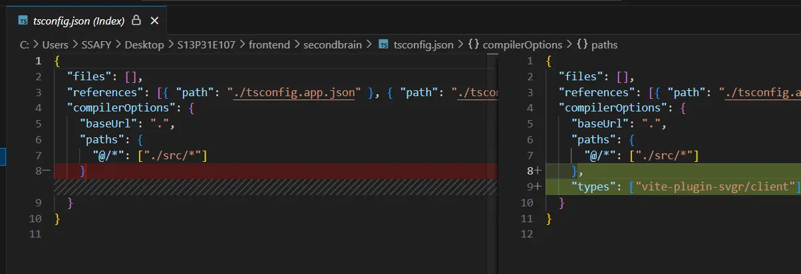
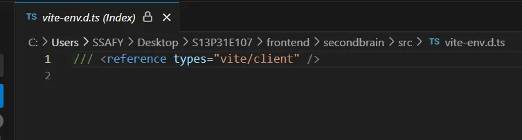

## **버튼 만들때 …**

`svg` 이용

`import {ReactComponent as UserIcon} from '@/shared/components/icon/User.svg';`

→ CRA 방식

vite에서는 이렇게 쓴다

`import MyIcon from './icons/my-icon.svg?react';`

[coyo-hm.github.io](https://coyo-hm.github.io/post/vite-react-svg)

### > vite-plugin-svgr 설치 후 설정

