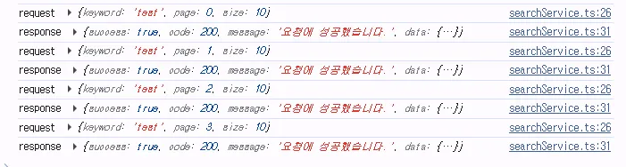

## 원인 : 무한 스크롤 트리거



### NoteList.tsx

```tsx
{
  root: scrollContainer,
  rootMargin: '100px',  // 화면 바닥에서 100px 전에 미리 로드
  threshold: 0.1,
}
```

- `바닥에서 100px 전에 다음 페이지 로드`
- 사용자가 스크롤하기 전에 미리 다음 페이지를 로드함

### **작동 원리**

```
┌─────────────────────────┐
│  보이는 영역 (Viewport)   │
│                         │
│  NoteItem               │
│  NoteItem               │
│  NoteItem               │
├─────────────────────────┤ ← 여기서 100px 위
│                         │
│  rootMargin: 100px      │ ← 이 영역에 들어오면 로드
│                         │
├─────────────────────────┤
│  <div ref={observerRef}>│ ← 감시 요소
└─────────────────────────┘
```

## 결과

- 패널이 작거나 데이터가 적으면 감시 요소가 자동으로 `rootMargin` 영역에 들어감
- 스크롤 없이도 자동으로 다음 페이지 로드
- 모든 페이지가 연속으로 로드됨

## 해결

1. `NoteList`에서 `page.results` 타입 캐스팅 오류 수정

- 튜플 접근 제거, 직접 배열 사용으로 전체 데이터 표시

```tsx
const allNotes = searchQuery.data.pages.flatMap((page) => {
  // const pageResults = page.results as unknown as [unknown, Note[]];
  // return pageResults[1] || [];
  return page.results || []; // 수정된 코드
});
```

2.  `IntersectionObserver` 감시 요소를 마지막 5번째 아이템으로 이동

- 작은 패널에서 자동 로드 방지

```tsx
{
  index === Math.max(0, allNotes.length - 5) && (
    <div ref={observerRef} className="h-1" />
  );
}
```

```
현재 페이지 데이터: 10개
├─ 아이템 0
├─ 아이템 1
├─ 아이템 2
├─ 아이템 3
├─ 아이템 4
├─ 아이템 5 ← 여기에 감시 요소 배치 (index === 10-5)
├─ 아이템 6
├─ 아이템 7
├─ 아이템 8
└─ 아이템 9
```

3. `rootMargin`을 0px로 조정하여 조기 트리거 방지

## 리뷰

**`NoteList.tsx`**

데이터 구조 개선이 잘 되어 있네요! 특히 타입 캐스팅을 제거한 부분이 좋습니다.

무한 스크롤 최적화도 눈에 띄는데요:

- `rootMargin`을 0px로 변경한 것은 좋지만, 마지막 5번째 아이템에 observer를 배치한 아이디어가 흥미로워요
- 다만 이 방식은 아이템이 5개 미만일 때 문제가 생길 수 있어요

```tsx
/* 마지막에서 5번째 아이템에 감시 요소 배치 */
{
  index === Math.max(0, allNotes.length - 5) && (
    <div ref={observerRef} className="h-1" />
  );
}
```

## 리뷰 해결

```tsx
/* 마지막 아이템 또는 마지막에서 3번째 중 작은 인덱스에 배치 */
{
  index === Math.min(allNotes.length - 1, Math.max(0, allNotes.length - 3)) && (
    <div ref={observerRef} className="h-1" />
  );
}
```

- 기존: 5개 미만 시 작동X
- 개선: 아이템 수와 무관하게 무한 스크롤 동작
