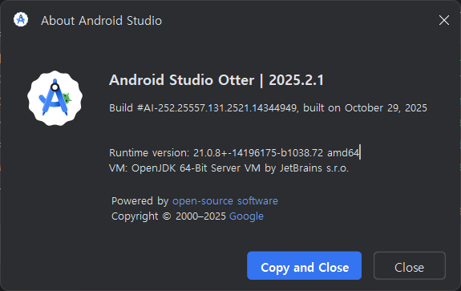

## 상황

코틀린 프로젝트를 에뮬레이터 실행하려니 빌드가 안됨

```
The project is using an incompatible version (AGP 8.13.0) of the Android Gradle plugin. Latest supported version is AGP 8.12.1
See Android Studio & AGP compatibility options.
```

프로젝트에서 AGP 버전을 8.13.0을 쓰고 있는데 여기서 인식하는 건 8.12.1이 최신 버전으로 8.13.0 버전이 없다며 빌드가 안되는 오류였다.

다른 팀원들은 문제 없이 잘 사용하는데 왜 나만 안되는 걸까 ...

<details>
<summary>AGP(Android Gradle Plugin)</summary>
안드로이드 앱의 빌드 및 배포 과정을 관리하는데 사용되는 다양한 플러그인(빌드, 테스트, 배포 등)을 포함하는 플러그인
</details>

## 원인

프로젝트에 설정된 AGP 버전과 android studio 버전 간 호환성 문제

android studio는 특정 버전 범위의 AGP와만 호환됨

- 프로젝트 설정: 8.13.0
- 개발 환경: 설치된 android studio가 지원하는 AGP 최대 버전은 8.12.1

**=> 결론: android studio 업데이트**

## 해결

이전 프로젝트 때 설치했던 거라 최신 버전일 거라고 생각해서 android studio 문제일 거라고 에상을 못 했다..



otter 버전으로 업그레이드 완료!
문제 없이 잘 빌드되었다.ㅎㅎ
