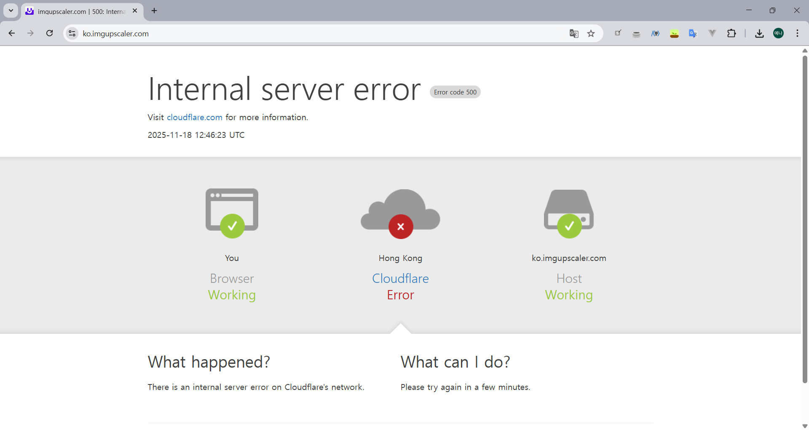

피피티 작업 중에 이런 화면을 봤다.

클라우드 플레어가 터졌다는 말이다.

## 클라우트플레어(cloudflare)란?

- CDN, DDoS 방어, DNS 관리, WAF(Web Application Firewall) 등을 제공하는 **웹 트래픽 보안·속도 최적화 서비스**다.
- 즉, 사용자와 웹 사이트 사이에서 트래픽을 중계하며 빠르고 안전하게 연결해 주는 서비스라는 뜻이다.

## 오늘 본 에러 화면은...

=> cloudflare 자체 장애 혹은 cloudflare를 사용 중인 사이트의 내부 문제

- cloudflare 네트워크나 DNS에 장애가 생기면 이런 화면이 뜸
- cloudflare를 사용하는 웹 사이트에 접속할 수 없다는 뜻

## 그래서 결론

복구될 때까지 기다리는 수밖에 없다.

당장 발표가 이틀 뒤인데 캔바로 작업을 하지 않은 거에 감사하자...
