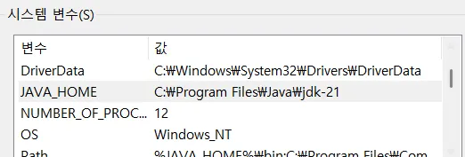
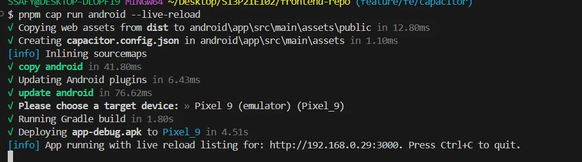
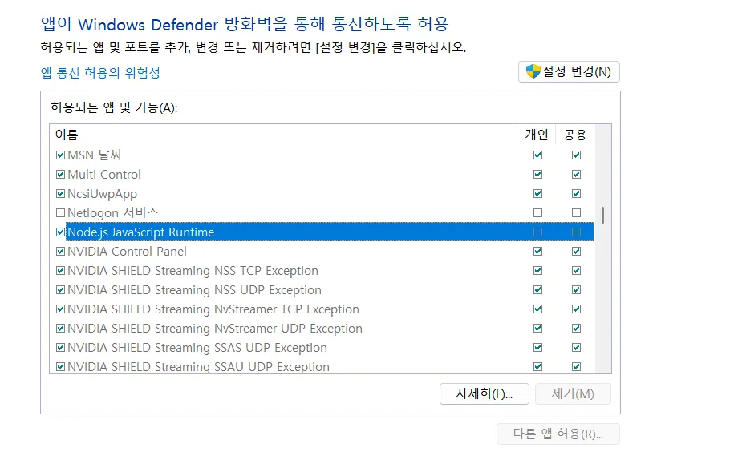
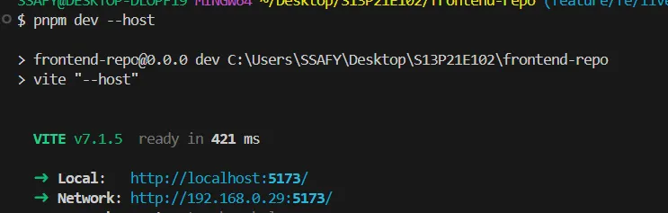
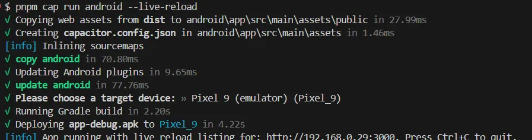

## live server 설정하기

## 문제 상황

> capacitor 설정 후 `pnpm cap run android --live-reload` 명령어로 에뮬레이터 실행 오류

<br/>

## 트러블 슈팅

<details>
<summary>⚠️ 에러 전문</summary>
<div markdown="1">

```bash
   pnpm cap run android --live-reload
  √ Copying web assets from dist to android\app\src\main\assets\public in 32.87ms
  √ Creating capacitor.config.json in android\app\src\main\assets in 1.50ms
  [info] Inlining sourcemaps
  √ copy android in 84.90ms
  √ Updating Android plugins in 12.78ms
  √ update android in 157.72ms
  √ Please choose a target device: » Pixel 9 (emulator) (Pixel_9)
  × Running Gradle build - failed!
  [error]
          > Configure project :app
          WARNING: Using flatDir should be avoided because it doesn't support any meta-data formats.

          > Configure project :capacitor-cordova-android-plugins
          WARNING: Using flatDir should be avoided because it doesn't support any meta-data formats.

          > Task :app:preBuild UP-TO-DATE
          > Task :app:preDebugBuild UP-TO-DATE
          > Task :app:mergeDebugNativeDebugMetadata NO-SOURCE
          > Task :capacitor-android:preBuild UP-TO-DATE
          > Task :capacitor-android:preDebugBuild UP-TO-DATE
          > Task :capacitor-cordova-android-plugins:preBuild UP-TO-DATE
          > Task :capacitor-cordova-android-plugins:preDebugBuild UP-TO-DATE
          > Task :app:javaPreCompileDebug
          > Task :app:generateDebugResValues
          > Task :capacitor-android:writeDebugAarMetadata
          > Task :capacitor-cordova-android-plugins:writeDebugAarMetadata
          > Task :capacitor-android:generateDebugResValues
          > Task :capacitor-android:generateDebugResources
          > Task :app:checkDebugAarMetadata
          > Task :capacitor-android:packageDebugResources
          > Task :capacitor-cordova-android-plugins:generateDebugResValues
          > Task :capacitor-cordova-android-plugins:generateDebugResources
          > Task :capacitor-cordova-android-plugins:packageDebugResources
          > Task :app:mapDebugSourceSetPaths
          > Task :app:generateDebugResources
          > Task :app:packageDebugResources
          > Task :app:createDebugCompatibleScreenManifests
          > Task :app:extractDeepLinksDebug
          > Task :capacitor-android:extractDeepLinksDebug
          > Task :capacitor-cordova-android-plugins:extractDeepLinksDebug
          > Task :app:parseDebugLocalResources
          > Task :capacitor-android:compileDebugLibraryResources
          > Task :capacitor-cordova-android-plugins:processDebugManifest
          > Task :capacitor-android:processDebugManifest
          > Task :app:mergeDebugResources
          > Task :capacitor-android:parseDebugLocalResources
          > Task :app:processDebugMainManifest
          > Task :app:processDebugManifest
          > Task :capacitor-cordova-android-plugins:compileDebugLibraryResources
          > Task :capacitor-android:generateDebugRFile
          > Task :capacitor-android:javaPreCompileDebug
          > Task :app:processDebugManifestForPackage
          > Task :capacitor-cordova-android-plugins:parseDebugLocalResources
          > Task :capacitor-android:compileDebugJavaWithJavac FAILED
          [Incubating] Problems report is available at:
          file:///C:/Users/SSAFY/Desktop/S13P21E102/frontend-repo/android/build/reports/problems/problems-report.html

          FAILURE: Build failed with an exception.

          * What went wrong:
          Execution failed for task ':capacitor-android:compileDebugJavaWithJavac'.
          > error: invalid source release: 21

          * Try:
          > Run with --stacktrace option to get the stack trace.
          > Run with --info or --debug option to get more log output.
          > Run with --scan to get full insights.
          > Get more help at https://help.gradle.org.

          BUILD FAILED in 18s
          32 actionable tasks: 32 executed

```

</div>
</details>

**👀 원인**

SDK 위치를 찾지 못해 발생

<br/>

👉 **환경변수 설정**

```bash
ANDROID_HOME = C:\Users\<사용자이름>\AppData\Local\Android\Sdk

Path 추가
%ANDROID_HOME%\platform-tools
%ANDROID_HOME%\tools
%ANDROID_HOME%\emulator
```

<br/>

<details>
<summary>⚠️ 다른 에러 전문</summary>
<div markdown="1">

```bash
  $ pnpm cap run android --live-reload
  √ Copying web assets from dist to android\app\src\main\assets\public in 32.87ms
  √ Creating capacitor.config.json in android\app\src\main\assets in 1.50ms
  [info] Inlining sourcemaps
  √ copy android in 84.90ms
  √ Updating Android plugins in 12.78ms
  √ update android in 157.72ms
  √ Please choose a target device: » Pixel 9 (emulator) (Pixel_9)
  × Running Gradle build - failed!
  [error]
          > Configure project :app
          WARNING: Using flatDir should be avoided because it doesn't support any meta-data formats.

          > Configure project :capacitor-cordova-android-plugins
          WARNING: Using flatDir should be avoided because it doesn't support any meta-data formats.

          > Task :app:preBuild UP-TO-DATE
          > Task :app:preDebugBuild UP-TO-DATE
          > Task :app:mergeDebugNativeDebugMetadata NO-SOURCE
          > Task :capacitor-android:preBuild UP-TO-DATE
          > Task :capacitor-android:preDebugBuild UP-TO-DATE
          > Task :capacitor-cordova-android-plugins:preBuild UP-TO-DATE
          > Task :capacitor-cordova-android-plugins:preDebugBuild UP-TO-DATE
          > Task :app:javaPreCompileDebug
          > Task :app:generateDebugResValues
          > Task :capacitor-android:writeDebugAarMetadata
          > Task :capacitor-cordova-android-plugins:writeDebugAarMetadata
          > Task :capacitor-android:generateDebugResValues
          > Task :capacitor-android:generateDebugResources
          > Task :app:checkDebugAarMetadata
          > Task :capacitor-android:packageDebugResources
          > Task :capacitor-cordova-android-plugins:generateDebugResValues
          > Task :capacitor-cordova-android-plugins:generateDebugResources
          > Task :capacitor-cordova-android-plugins:packageDebugResources
          > Task :app:mapDebugSourceSetPaths
          > Task :app:generateDebugResources
          > Task :app:packageDebugResources
          > Task :app:createDebugCompatibleScreenManifests
          > Task :app:extractDeepLinksDebug
          > Task :capacitor-android:extractDeepLinksDebug
          > Task :capacitor-cordova-android-plugins:extractDeepLinksDebug
          > Task :app:parseDebugLocalResources
          > Task :capacitor-android:compileDebugLibraryResources
          > Task :capacitor-cordova-android-plugins:processDebugManifest
          > Task :capacitor-android:processDebugManifest
          > Task :app:mergeDebugResources
          > Task :capacitor-android:parseDebugLocalResources
          > Task :app:processDebugMainManifest
          > Task :app:processDebugManifest
          > Task :capacitor-cordova-android-plugins:compileDebugLibraryResources
          > Task :capacitor-android:generateDebugRFile
          > Task :capacitor-android:javaPreCompileDebug
          > Task :app:processDebugManifestForPackage
          > Task :capacitor-cordova-android-plugins:parseDebugLocalResources
          > Task :capacitor-android:compileDebugJavaWithJavac FAILED
          [Incubating] Problems report is available at:
          file:///C:/Users/SSAFY/Desktop/S13P21E102/frontend-repo/android/build/reports/problems/problems-report.html

          FAILURE: Build failed with an exception.

          * What went wrong:
          Execution failed for task ':capacitor-android:compileDebugJavaWithJavac'.
          > error: invalid source release: 21

          * Try:
          > Run with --stacktrace option to get the stack trace.
          > Run with --info or --debug option to get more log output.
          > Run with --scan to get full insights.
          > Get more help at https://help.gradle.org.

          BUILD FAILED in 18s
          32 actionable tasks: 32 executed
```

</div>
</details>

**👀 원인 `invalid source release: 21`**

프로젝트는 jdk21을 요구하지만 컴퓨터는 jdk17로 설정되어있음

<br/>

**👉 환경변수 설정**

jdk21로 업그레이드 해줌



<br/>

<details>
<summary>⚠️ 또또 다른 에러</summary>
<div markdown="1">

```bash
pnpm cap run android --live-reload
√ Copying web assets from dist to android\app\src\main\assets\public in 14.25ms
√ Creating capacitor.config.json in android\app\src\main\assets in 1.37ms
\ copy android [info] Inlining sourcemaps
√ copy android in 56.53ms
√ Updating Android plugins in 7.98ms
√ update android in 78.93ms
√ Please choose a target device: » Pixel 9 (emulator) (Pixel_9)
√ Running Gradle build in 42.06s
× Deploying app-debug.apk to Pixel_9 - failed!
[error] Selected hardware device emulator-5554
        Installing C:\Users\SSAFY\Desktop\S13P21E102\frontend-repo\android\app\build\outputs\apk\debug\app-debug.apk...
        Starting application activity com.ssafy.watchout/com.ssafy.watchout.MainActivity...
        ADBs is unresponsive after 5000ms, killing server and retrying...
        Error: Command failed: C:\Users\SSAFY\AppData\Local\Android\Sdk\platform-tools\adb -s emulator-5554 shell am
        start -W -n com.ssafy.watchout/com.ssafy.watchout.MainActivity
        adb.exe: device offline

        at genericNodeError (node:internal/errors:983:15)
        at wrappedFn (node:internal/errors:537:14)
        at ChildProcess.exithandler (node:child_process:417:12)
        at ChildProcess.emit (node:events:518:28)
        at maybeClose (node:internal/child_process:1101:16)
        at ChildProcess._handle.onexit (node:internal/child_process:304:5)

```

</div>
</details>

👀 원인

컴퓨터 - 에뮬레이터 간 통신 문제

<br/>

**👉 adb 서버 재시작**

```bash
appdata/local/android/platform-tools 경로로 이동
adb kill-server // 서버 종료
adb start-server // 서버 다시 시작
```

<br/>

✅ **해결**



<br/>

⚠️ 터미널 에러는 해결 but 에뮬레이터 에러 발생 + live load 안됨


👀 원인

pc 방화벽 → 에뮬레이터 3000번으로 들어오는 연결 차단하고 있을 가능성

<br/>

👉 방화벽 확인



에 허용중인디…?

폰으로도 접속해봤는데 안됨 → 네트워크 문제

… 결국 해결 못함

그냥

`pnpm build`

`pnpm cap run android`로 실행함

<br/>

👉 웹으로 접속해보기

`pnpm dev --host`



<br/>

👉 환경변수도 5173으로 설정해줌



<br/>

👀 5173을 설정했음에도 capacitor cli가 강제로 3000번 포트를 사용하는 상황

`capacitor.config.ts` 파일 설정보다 `pnpm cap run` 명령어가 더 높은 우선순위를 가지기 때문

<br/>

👉 앱 실행 명령어에 주소와 포트 추가해주기

`pnpm cap run android --live-reload --host=192.168.0.29 --port=5173`

- `--host` : 라이브 리로드 서버의 ip 주소를 명시적으로 지정
- `--port=5173` : 라이브 리로드 서버 포트 번호 명시적으로 지정

정확한 포트번호로 접속하기!!!

<br/>

✅ 해결

`pnpm cap run android --live-reload --host=192.168.0.29 --port=5173`
