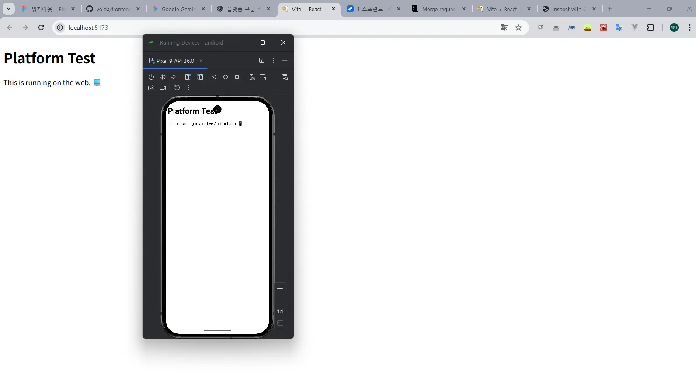

1. `/utils/platform.ts` → 플랫폼 구분

   ```tsx
   import { Capacitor } from "@capacitor/core";

   export const isMobilePlatform = (): boolean => {
     return Capacitor.isNativePlatform();
   };
   ```

1. `/src/App.tsx` → 라우팅 분기 처리

   ```tsx
   import { isMobilePlatform } from "@/utils/platform";
   import RouterMobile from "@/routes/RouterMobile";
   import RouterWeb from "@/routes/RouterWeb";

   const App = () => {
     const isMobile = isMobilePlatform();
     return <div>{isMobile ? <RouterMobile /> : <RouterWeb />}</div>;
   };
   export default App;
   ```

**성공 !**

