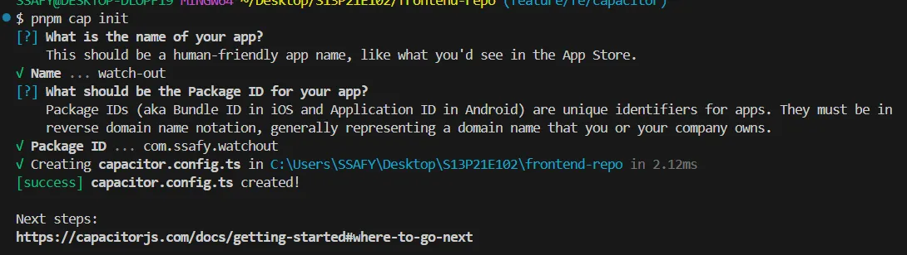

### **1️⃣ 프로젝트 생성**

```bash
pnpm create vite <프로젝트이름> --template react-ts
```

### **2️⃣ 코드 포매팅 설정**

```bash
pnpm add -D eslint @eslint/js typescript-eslint eslint-plugin-react
	eslint-plugin-react-hooks eslint-plugin-react-refresh
	eslint-plugin-import prettier eslint-config-prettier eslint-plugin-prettier
```

1. prettier 설정

   `.prettierrc`

   ```bash
   {
     "endOfLine": "lf",
     "singleQuote": true,
     "semi": false,
     "useTabs": false,
     "tabWidth": 2,
     "trailingComma": "all",
     "printWidth": 80,
     "arrowParens": "always"
   }

   ```

1. eslint 설정

<details>
<summary>eslint 규칙들</summary>
<div markdown="1">

- **eslint:recommended**
  - ESLint 기본 제공
  - 사용하지 않는 변수, 선언되지 않은 변수, 도달 불가능한 코드 등 **버그성 코드 방지 규칙** 포함
  - 무난하고 가벼워서 대부분 프로젝트에서 기본으로 깔고 시작
  - **plugin:@typescript-eslint/recommended**
    - TypeScript 프로젝트에서 필수
    - 타입과 관련된 잘못된 패턴 잡아줌
  - **plugin:react/recommended**
    - React 프로젝트라면 자주 씀
    - JSX, props 사용 등 기본 규칙
  - **plugin:react-hooks/recommended**
    - Hooks 규칙 강제 (useEffect deps 체크, 훅 호출 위치 등)
  - **next/core-web-vitals** (Next.js 프로젝트일 때)
    - `eslint-config-next` 설치하면 제공
    - React 18, Next 최적화 규칙 포함
  - **eslint-config-prettier**
    - Prettier랑 충돌하는 포맷 규칙 꺼줌
  - **코드 안전성**
    - `no-unused-vars` : 안 쓰는 변수 금지
    - `no-undef` : 선언 안 한 변수 사용 금지
    - `eqeqeq` : `==` 대신 `===` 강제
    - `no-console` : console.log 제한 (warn/error만 허용)
  - **React 관련**
    - `react/jsx-uses-react`, `react/jsx-uses-vars` : JSX에서 안 쓰는 import 정리
    - `react-hooks/rules-of-hooks` : 훅은 최상위에서만 호출
    - `react-hooks/exhaustive-deps` : useEffect deps 자동 검사
  - **코드 스타일**
    - `prefer-const` : 바뀌지 않는 변수는 const
    - `no-var` : var 사용 금지
    - `arrow-body-style` : 화살표 함수 간결화
    - `import/order` : import 순서 정리 (eslint-plugin-import)

</div>
</details>

사용한 규칙들

- `eslint:recommended`
- `plugin:@typescript-eslint/recommended`
- `plugin:react/recommended`
- `plugin:react-hooks/recommended`
- `eslint-config-prettier`

`eslint.config.js`

```jsx
'no-unused-vars': 'warn',
      'no-undef': 'error',
      eqeqeq: ['error', 'always'],
      'no-var': 'error',
      'import/order': [
        'warn',
        {
          groups: [
            'builtin', // Node.js 기본 모듈
            'external', // 외부 라이브러리
            'internal', // 프로젝트 내부 alias
            ['parent', 'sibling', 'index'], // 상대 경로
          ],
          alphabetize: { order: 'asc', caseInsensitive: true },
          ' newlines-between': 'always', // 그룹 사이 줄바꿈 강제
        },
      ],
```

`package.json`

```bash
"lint:fix": "eslint . --fix", // 추가
```

### 3️⃣ emotion 세팅

1. 설치

   ```bash
   pnpm add @emotion/react
   ```

2. babel 플러그인

   1. 설치

   ```bash
   pnpm add -D @emotion/babel-plugin
   ```

   b. 설정

   ```tsx
   import { defineConfig } from 'vite'
   import react from '@vitejs/plugin-react'
   **import babel from 'vite-plugin-babel'**

   // https://vite.dev/config/
   export default defineConfig({
     plugins: [
       react(),
       **babel({
         babelConfig: {
           plugins: ['@emotion/babel-plugin'],
         },
       }),**
     ],
   })

   ```

### 4️⃣ capacitor 설정

```bash
// 1. 패키지 설치
pnpm add @capacitor/core
pnpm add -D @capacitor/cli

// 2. 초기화
pnpm cap init

// 3. android 추가
pnpm add @capacitor/android
pnpm cap add android

// 4. 빌드
pnpm build

// 5. capacitor에 빌드 결과물 복사
pnpm cap sync

```



### 5️⃣라이브 서버 설정하기

```tsx
TypeScript

// capacitor.config.ts

import type { CapacitorConfig } from '@capacitor/cli';

const config: CapacitorConfig = {
  appId: 'com.example.app',
  appName: 'my-app',
  webDir: 'dist',
  server: {
    url: 'http://192.168.0.10:5173',
    cleartext: true
  }
};

export default config;`
```

- **`cleartext: true`**
  - 보안상의 이유로 `http` 통신을 차단
  - 개발 중에 `http`로 통신하는 로컬 개발 서버 접속을 허용해주는 설정

실행

`pnpm cap run android --live-reload`

→ 안됨 ㅠ

### 6️⃣ 프로젝트 실행하기

**리액트**

```bash
pnpm i
pnpm dev
```

**capacitor 에뮬레이터 실행하기**

```bash
pnpm build

//최초 실행의 경우 android 폴더에 가서 그래들 클린 빌드 해줍시당
cd android
./gradlew clean build
cd ..

// capacitor 설정했을 경우
pnpm cap sync android

// 안드로이드 스튜디오에서 에뮬레이터 실행하고 아래 명령어 실행
// 명령어 실행하면 터미널에 에뮬레이터 선택창이 나옴ㅔㅜ
pnpm cap run android
```
