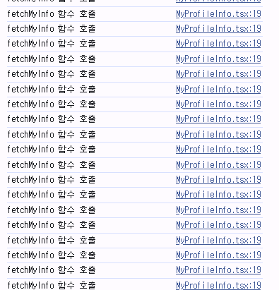

## 상황

**파일 구조**
<br/>
[MyProfileInfo]<br/>
└── [ProfileView props={myInfo}] `/my-profile`<br/>
└── [ProfileEdit props={myInfo}] `/my-profile?edit`

`MyProfileInfo`에서 내 정보 데이터를 api 호출로 가져오고<br/>
각각 `ProfileView`, `ProfileEdit` 컴포넌트로 props로 데이터를 넘겨주는 형태

**문제 상황**
`ProfileEdit`에서 데이터를 수정 완료하면 `ProfileView`로 navigate 함
수정된 데이터가 바로 화면에 보이지 않고 화면에 재진입하거나 새로고침시에만 보임

## 원인

데이터를 상위 컴포넌트인 MyProfileInfo에서만 api 호출을 하기 때문에<br/>
ProfileView 컴포넌트만으로는 수정된 데이터를 불러오지 못함!

**👉 즉, 상태가 갱신되지 않음**

## 해결

```
내 생각
api 호출 함수를 props로 내려주고
ProfileView에서 useEffect로 화면 렌더시에 다시 불러오기
```

### 과정 1

MyProfileInfo에서 fetchMyInfo 함수를 ProfileView 컴포넌트에 props로 전달<br/>
ProfileView에서 useEffect로 호출

```jsx
useEffect(() => {
  fetchMyInfo()
}, [])
```

**⚠️ 에러**

```
React Hook useEffect has a missing dependency: 'fetchMyInfo'. Either include it or remove the dependency array. If 'fetchMyInfo' changes too often, find the parent component that defines it and wrap that definition in useCallback.eslintreact-hooks/exhaustive-deps
```

**👉 원인**
의존성 배열에 아무것도 넣지 않아서 오류 메시지 표시<br/>
나중에 문제가 생길 수도 있음<br/>
fetchMyInfo()가 api 호출해서 데이터를 불러오는 함수인데<br/>
이 함수를 감지하고 있지 않으면 예전 함수를 참조하거나 함수가 바뀌어도 useEffect가 실행되지 않을 수도 있음

**✅ 해결**
의존성 배열에 `fetchMyInfo`를 넣자!

```javascript
useEffect(() => {
  fetchMyInfo()
}, [fetchMyInfo])
```

### 과정 2

**⚠️ 에러**



허허 .. 무한 호출이 일어나고 있었다 ㅎㅎ
**👉 원인**
`MyProfileInfo` 부모 커모넌트가 리렌더링될 때마다 fetch `fetchMyInfo`가 새로운 함수로 만들어짐<br/>
자식 컴포넌트 `ProfileView`에서는 `fetchMyInfo`가 계속 바뀐다고 감지<br/>
그래서 `useEffect`가 계속 실행 -> 무한 호출의 굴레

**✅ 해결**
useCallback 사용!

useCallback이란?([공식문서](https://ko.react.dev/reference/react/useCallback))<br/>
리렌더링 간에 함수 정의를 캐싱해주는 React Hook
자주 쓰는 함수를 캐싱해두어 값을 재사용하는 것<br/>
`useCallback(메모이제이션해 줄 콜백함수, 의존성 배열)`

부모 컴포넌트에서 `fetchMyInfo` 함수를 `useCallback`을 사용해서 적어주자!

```jsx
const fetchMyInfo = useCallback(async () => {
  try {
    const myData = await userAPI.getUserMeInfo()
    setMyInfo(myData)
    console.log('fetchMyInfo 함수 호출')
  } catch {
    error('내 정보를 불러오는 데 실패했습니다.')
  }
}, [])
```

자식 컴포넌트 `ProfileView`에서도 `fetchMyInfo` 함수를 사용하니까<br/>
함수 참조를 고정하기 위해서 부모 컴포넌트 `MyProfileInfo`에서 `fetchUserInfo()` 함수를 `useCallback`으로 작성

부모 컴포넌트에서 fetchMyInfo 함수가 메모이제이션되어서 리렌더링 될 때마다 새로 생기는 것이 아니니까<br/>
자식 컴포넌트에서는 함수 참조가 변하지 않게 되고<br/>
useEffect 의존성 배열에서 감지하는 fetchMyInfo가 변하지 않으니 무한 호출 밟생x
