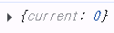

# `useRef`

## 1. 저장공간으로서의 기능

- 변수의 단점 커버
  - 그냥 let으로 선언한 변수의 값을 변화시켜주면
  - ui에 바로 반영되지 않음
- useState 장점 + 변수의 장점
  - useState 특징
    - 값 유지
    - 값이 바뀔때 매번 리렌더링이 일어남
  - 변수의 단점
    - 값을 계속 바꿀수는 있지만
    - 값이 쉽게 휘발됨

**=> useRef는 값을 유지시켜주는 변수**

- 앱이 끝날때까지 라이프 사이클 주기동안 값을 유지시켜줌
- useState처럼 ui를 업데이트 하진 않음

⚠️ 에러 발생 <br/>
`<p>ref : {refCount}</p>`

```
react-dom_client.js?v=e931f5c9:5438 Uncaught Error: Objects are not valid as a React child (found: object with keys {current}). If you meant to render a collection of children, use an array instead
```

- `useRef`가 주는 값은 객체임
- ref를 콘솔 찍어보면 아래처럼 나옴



- ref에 접근하기 위해서는 `current` 사용

-> `<p>ref : {refCount.current}</p>` 로 작성

**언제 사용하면 좋을까?**

- 변수처럼 값을 저장할 필요가 있는 변수 단, ui에 보일 필요가 없는 애들
- ui에 보여야된다면 useState사용

## 실전 예제 - 검색 기능

- a라는 검색어로 검색을 하고 바로 다시 a 검색어로 검색을 한다면 다시 검색할 필요x(불필요한 api 호출)
  -> 검색어가 바뀌는 경우에만 검색 기능 동작(api 호출)

## 2. DOM 요소를 선택하는 기능

- document.getElementById 같이 선택할 경우 `useRef` 사용 가능

'검색' 버튼을 눌렀을 때 input에 focus 이벤트가 발생하도록 하고 싶다

1. `useRef` 객체 만들기
   ```js
   const inputEl = useRef(null)
   ```
2. `input` 요소에 연결
   ```jsx
   <input type='text' ref={inputEl} />
   ```
3. focus 이벤트가 발생하도록 함수로 연결
   ```jsx
   <button onClick={() => inputEl.current.focus()}>검색</button>
   ```

### 실전 예제 - scrollToTop

1. `topRef` 생성

   ```js
   const topRef = useRef(null)
   ```

2. `scrollToTop` 함수
   - `topRef.current`로 감
   ```js
   const scrollToTop = () => {
     if (topRef.current) {
       topRef.current.scrollIntoView({ behavior: 'smooth' })
     }
   }
   ```
3. 버튼에 연결
   ```jsx
   <button onClick={scrollToTop}>상단으로 스크롤</button>
   ```

**div에 `ref`가 어떻게 연결?**

```jsx
<div
  //// 이 컴포넌트가 실제러 렌더링된 후에 해당 DOM 요소의 실제 참조(포인터 같은거)를 `topRef.current`에 자동으로 할당해줌
  //-> 렌더링 완료 시점에 ref를 연결해서 topRef.currnet에 실제 DOM 요소를 넣어줌
  //=> 컴포넌트 렌더링 이후에는 topRef.current가 해당 div DOM 요소를 가리킴
  ref={topRef}
  style={{ height: '50vh', backgroundColor: 'lightblue' }}
>
  페이지 상단
</div>
```

-> 따라서 초기에는 null 이었던 `topRef`가 렌더링 이후에는 div 요소에 연결됨
